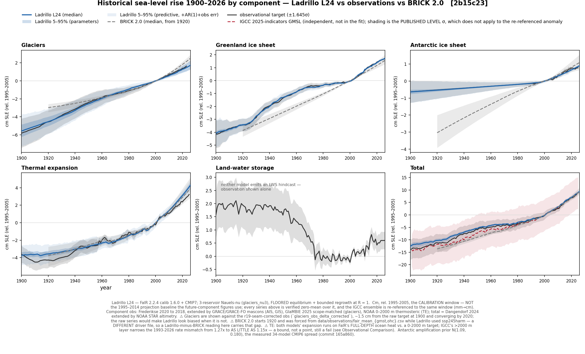
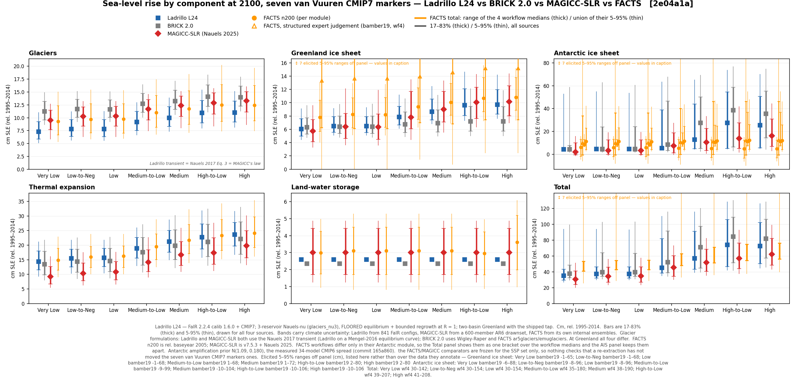
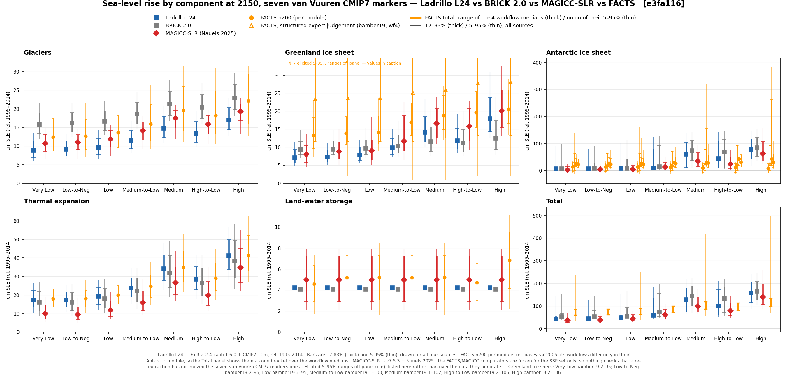
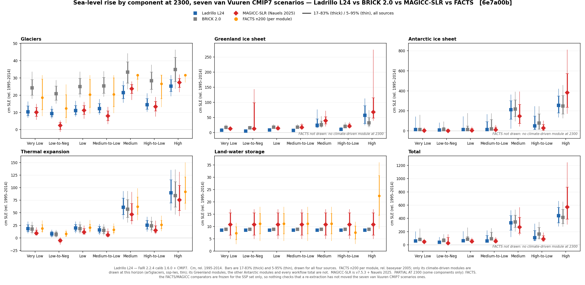
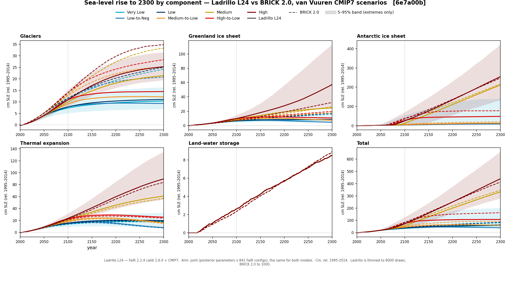
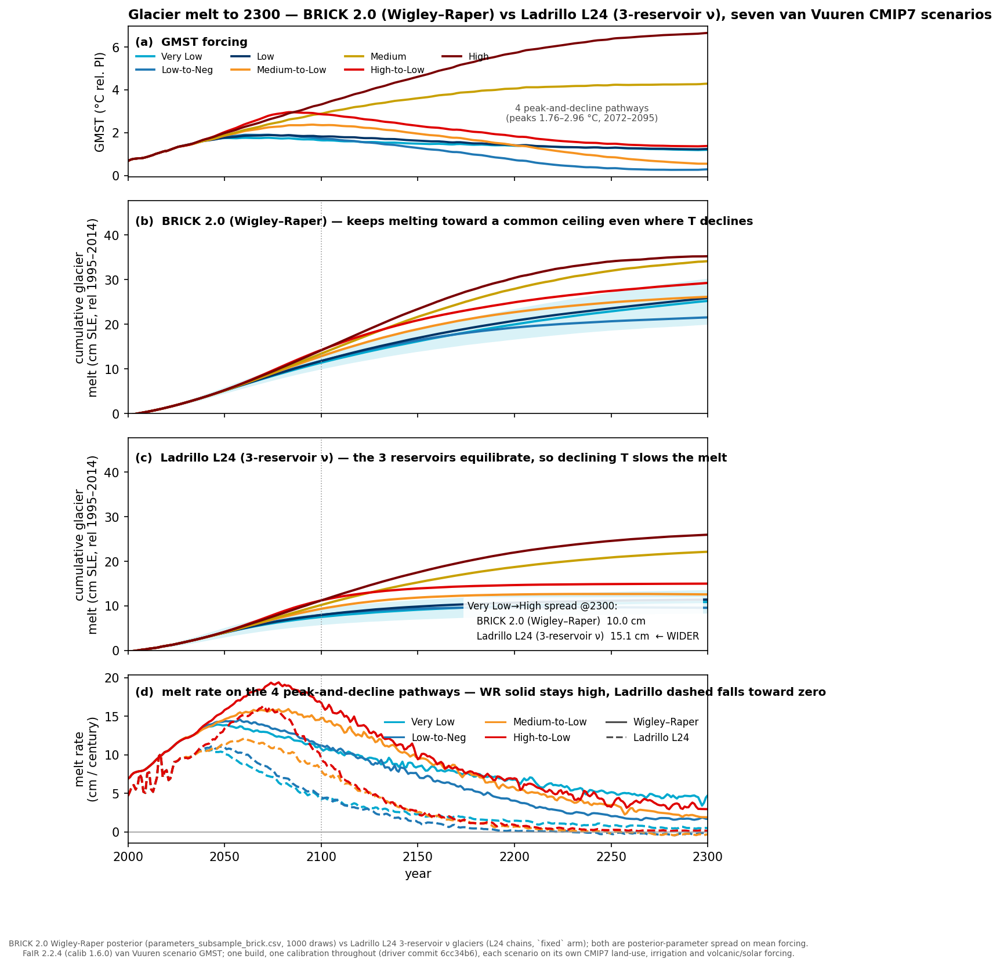
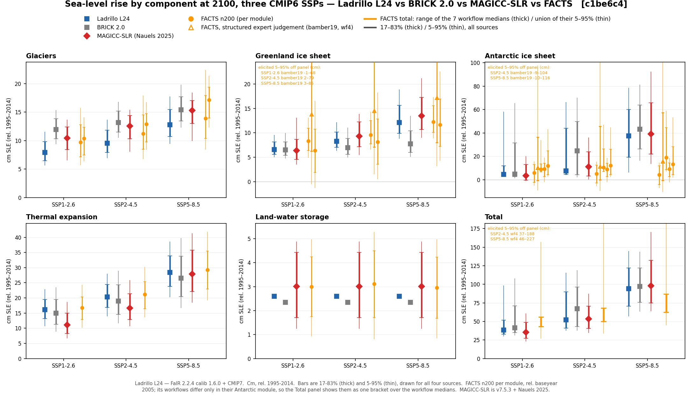
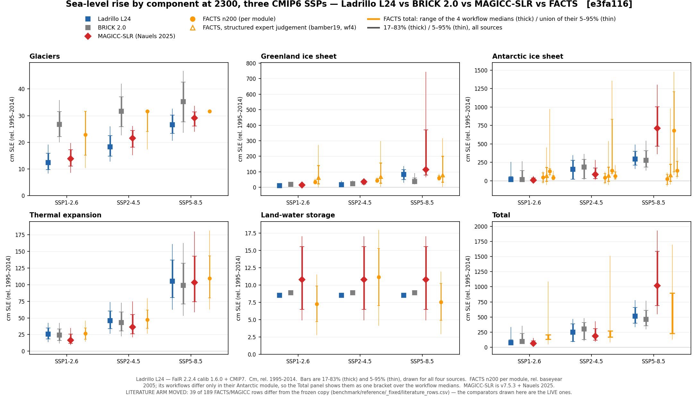
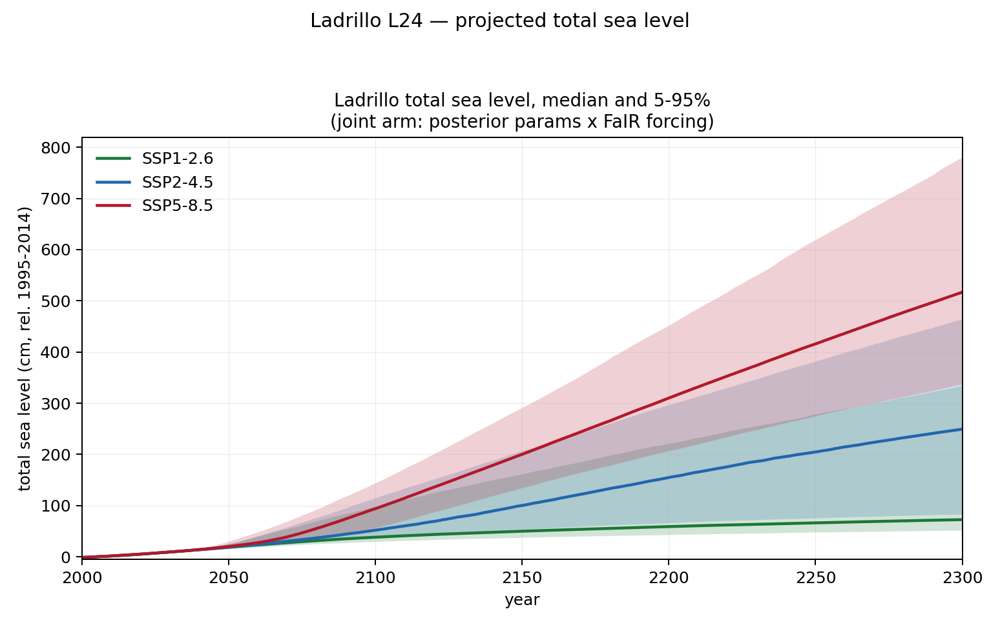

# Ladrillo (L24)

Ladrillo is a derivative of Tony Wong's BRICK2.0 model. Ladrillo was developed by Marcus C Sarofim
using the Claude model. The primary goals for Ladrillo were to add additional observational data,
update the glacier module to better match observations and to halt melting for stabilization
scenarios, update the Antarctic calibration approach to better match observations prior to 1980, and
update the Greenland model to incorporate the different responses of surface melt balance and ice
discharge.

Ladrillo compares well relative to the other models and sits in a unique space. Unlike
MAGICC, Ladrillo is designed to work with the FaIR model. Unlike FACTS, Ladrillo has a simplified
structure. Ladrillo does a good job matching historical observations, with the primary weakness being
thermal expansion, though that is inherited from FaIR and does not appear when running with OHC from
observation. For future projections, Ladrillo matches physical expectations and is comparable to the
other models despite different structural approaches.

> **Vintage.** This document describes posterior **L24**. Basis for every number below: **cm, re-referenced to 1995–2014**.

---

## Ladrillo Structural Updates

### GSIC

BRICK 2.0's glacier model is a **single Wigley–Raper reservoir that is either not melting or
committed to full melt**. Because that formulation saturates, it cannot reproduce the observed
20th-century trajectory and the scenario spread at the same time. Ladrillo replaces it with a
**Mengel-style equilibrium volume `S_eq` driven by a Nauels-ν transient**, which separates *how much*
ice is committed at a given warming from *how fast* it gets there — the two things the single
saturating reservoir conflated — and splits the world into three reservoirs on regional temperature.

**SLOWP — RGI regions 03, 09, 07, 06** (Arctic Canada North, Russian Arctic, Svalbard, Iceland).
Large, high-latitude, long relaxation time, and strongly amplified relative to global mean
temperature (prior 2.50). This block dominates the glacier contribution in both the hindcast and the
projections.

**FAST — the remaining 13 RGI regions.** Smaller, faster-responding bodies with weak amplification
(prior 1.45). It equilibrates quickly enough that its committed volume is close to its realised
volume through most of the record.

**R19 — Antarctic and Subantarctic periphery.** This block exists for an **observational scope**
reason, not a dynamical one. The historical glacier target (Frederikse) **assumes zero
Antarctic-periphery melt**, while the GlaMBIE series spliced in from 2019 onward **includes it**.
Folding R19 into either other block would leave the model's hindcast scope mismatched against the
scope of the series it is scored on. Keeping it separate lets the hindcast be evaluated on
**SLOWP + FAST — exactly the target's scope** — while R19 still contributes to projected totals. Its
amplification prior (0.72) is also far below the other two, so it is not physically interchangeable
with them either.

**Compared with BRICK 2.0 and MAGICC.** Against **BRICK 2.0** the change is structural: one
saturating reservoir becomes three regional ones with sampled amplification, so the committed volume
and the approach rate are separately identified. Against **MAGICC** the *transient* law is the same
object — Ladrillo's transient is Nauels 2017 Eq. 3, which is MAGICC's law — so the two models are
closer in glacier form than either is to BRICK 2.0. Where they differ is the equilibrium curve:
MAGICC carries a tabulated equilibrium spanning 0.0–10.3 K with **no negative branch** and a positive
27.6–135.9 mm floor, while Ladrillo fits its equilibrium per block.

**Regrowth potential.** BRICK 2.0's melt-only ratchet cannot regrow ice at all, and of the four
models compared here **MAGICC was until recently the only one that could express glacier regrowth —
the other three are blind to it rather than agreeing about it.** Ladrillo now can. The law is

    S_eq = max( a·(1 − exp(−b·(T − T_off))), 0 )        # the FLOOR
    dS   = min( κ·|T − T_eq|^ν, 1 ) · (S_eq − S)        # sign KEPT, not discarded

⚠ **The floor is load-bearing, not cosmetic.** `S_eq` goes negative below `T_off` on **12.9%** of
block × draw cells at the van Vuuren low-overshoot marker at 2300 on our own climate (47.6% on
MAGICC's), so unclamping without flooring would regrow glaciers **past their 1850 extent** — less
defensible than the ratchet it replaces. Boundedness is structural rather than a second clamp: the
multiplier is capped at 1, so each step is a convex combination of `S` and `S_eq`, and with `S_eq ≥ 0`
the stock can never fall below the floor. The regrowth rate ratio R = 1 is a **stated convention, not
a fitted quantity** — removing the clamp moves the hindcast by 0.014 cm, 3% of the glacier target's
median σ, so no refit can inform it. On a monotonically warming path the new and old laws are
**bit-identical**; measured as a law-only swap on a held posterior, the change delivers
**−0.20 cm** at the low-overshoot marker at 2300 and ~0 elsewhere. Its value is that stabilization and decline scenarios now halt and reverse rather than
ratchet.

### Greenland

BRICK 2.0 treats Greenland as **one body with one response channel**. Ladrillo replaces that with a
**two-channel, two-basin sheet**.

**Two channels (fast / slow).** A single channel cannot carry outlet/dynamic discharge and
surface-mass-balance response with different time constants. ⚠ The channel ordering is **enforced**
(`--gis-ordered`) as a wedge in the log-prior: without the constraint the two channels are
exchangeable and the posterior can invert them, which is not a physical solution. The ordering is
imposed, not identified — the data do not by themselves separate which channel is which.

**Two basins.** The sheet is split into an **active** basin (SW+CW+CE+SE+NW) and a **high** basin
(NO+NE), each carrying its own fast/slow channel pair, with sector shares scored against Mouginot.
⚠ The reference basin is **pinned** rather than sampled because the common mode of the basin scales is
*exactly* degenerate — pinning removes an unidentified direction rather than adding information. A
third basin was tested and buys nothing.

**Amplification.** `gis_amp` is sampled with an `amp(GMST)` law rather than pinned; it is the dominant
control on the 2100 Greenland projection, and the law reduced the relevant spread from 9.80 to
7.37 cm.

**High-basin volume tap.** A post-2100 commitment above a threshold: V = 5.64 m, τ = 800 yr, onset
4.69 K, two stages, whole-sheet. It is off by default, port-tested, and does not fire on scenarios
that stay below the onset. ⚠ It is **likelihood-inert** — it acts entirely after the observational
record, so it cannot be calibrated in and is a stated structural choice.

**Compared with BRICK 2.0 and MAGICC.** Against BRICK 2.0 this is the largest structural change in
the model: one channel and one body become four channels across two basins with an enforced ordering
and an observationally-anchored sector split. Ladrillo's Greenland is correspondingly the component
where the hindcast gain over BRICK 2.0 is largest.

---

## Ladrillo Calibration Data Updates

Additional or replaced observational inputs, relative to BRICK 2.0:

| data source | what it constrains |
|---|---|
| **Dangendorf 2024** GMSL | The total, replacing the previous GMSL reconstruction. Its σ is inflated by **Frederikse's own budget-closure spread** — the closure error is measured, so it is used rather than assumed. |
| **GlaMBIE** glacier series (2019 onward) | The modern glacier rate, spliced onto Frederikse. ⚠ It **includes** Antarctic-periphery melt where Frederikse excludes it, which is why R19 is a separate block. |
| **JPL GRACE / GRACE-FO mascons** | Land-water storage 2019–2026, which had been held flat; the closure σ is trend-extended over the same period. |
| **Mouginot** Greenland sector shares | The basin split, as a shares term rather than a level. |
| **Rignot 2019** Antarctic SMB, area-corrected ×0.888 | The absolute Antarctic flux scale. The posterior had pinned SMB − discharge to −145 ± 15 Gt/yr while each flux individually sat at ±505/±509 — the classic input–output degeneracy; one term anchors it. |
| **Glacier inventory** likelihood + a 19th-century flow constraint, `S(1900) − S(1850) ~ N(0.020, 0.009)` m SLE | The absolute inventory and the pre-observational flow, neither of which the 20th-century transient identifies on its own. |
| **CMIP6 regional amplification** (34–41 models) | Priors on the per-block glacier amplification and on Antarctic amplification, replacing pinned constants. |
| **Paleo constraints** on DAIS geometry, in a standardised correlation form | The seven freed geometry parameters (below). |

⚠ **Deliberately removed: IMBIE**, dropped from the Antarctic likelihood on 2026-06-13 to avoid
double-weighting the same mass-balance information already entering through other terms.

**Forcing.** Mean **FaIR 2.2.4 (fair-calibrate 1.6.0, CMIP7 history to 2023)** per scenario, with
FaIR-consistent conditional weighting. Fixing the climate driver is what makes the posterior spread
parameter uncertainty — and is why the fixed-driver bands are not width-comparable to MAGICC's or
FACTS'. The projection bands reported below are the **joint** (posterior × FaIR-forcing) bands, which
are comparable.

**Sampler.** Over-dispersed chain starts. Every earlier run started all four chains at the same
point, which makes R̂ anti-conservative: between-chain variance cannot reflect posterior mass that no
chain ever reached.

---

## Ladrillo Calibration Approach Updates

**58 parameters are sampled**: 17 Antarctic, 9 Greenland, 19 glacier, 13 remaining (thermal
expansion, two discrepancy bases, and four AR(1) noise pairs).

**AIS parameters that have been freed** (17):

`ais_ocean_temperature₀`, `antarctic_alpha`, `antarctic_nu`, `antarctic_temp_threshold`,
`anto_alpha`, `anto_beta`, `antarctic_lambda`, `antarctic_gamma`, `antarctic_kappa`,
`ais_gmst_amp`, `ais_mu`, `ais_bedheight0`, `ais_slope`, `ais_iceflow0`, `ais_precip0_LOG`,
`ais_runoff_Ton`, `ais_c`.

Three of those changes carry the Antarctic improvement:

**The seven DAIS geometry parameters** (`ais_mu`, `ais_bedheight0`, `ais_slope`, `ais_iceflow0`,
`ais_precip0_LOG`, `ais_runoff_Ton`, `ais_c`) are freed under a **joint paleo prior** in standardised
correlation form — condition number 2.75, against 5.2 × 10¹³ for the raw covariance. ⭐ **This is the
change that fixed the pre-1990 Antarctic melt.** With the geometry fixed at the prior medoid, BRICK
2.0 draws far more early-20th-century Antarctic mass loss than the record supports; Ladrillo tracks
the observations to within a hundredth of a centimetre over the same window (see the hindcast table
below).

**The runoff line is sampled in its identified direction.** `h0` and `c` enter the model only as
`hR = h0 + c·T_ant`, so individually they ride a correlation-0.9997 ridge no sampler can traverse.
Ladrillo samples `T_on = −h0/c`, the runoff **onset temperature**, which is the combination the data
actually constrain.

**Antarctic amplification is freed.** Stock DAIS hard-codes 1.196 — the inverted paleo *equilibrium*
regression applied to a *transient* problem. Ladrillo samples it under N(1.09, 0.180), the measured
CMIP6 between-model spread. ⚠ **It is prior-dominated**: the posterior standard deviation is 0.95–0.99
of the prior's at every width tried, and it carries 386 cm per unit on Antarctica at 2300, so **the
prior's width is the projection uncertainty**, not a starting guess the data will tighten. No
available observation constrains it — the coefficient multiplies a temperature *anomaly*, so its
footprint is 0.083 °C over the window where the data are and 0.455 °C at 2300.

⚠ **Convergence is disclosed, not claimed.** L24 is accepted under the deliverable criterion: 19
parameter marginals fail R̂ < 1.05 — the documented Antarctic-geometry ridge, present in every
vintage — while **projected sea level converges** (R̂ = 1.008 at 2100, 1.011 at 2150; ESS ≈ 1050).

---

## Ladrillo Observational Comparison

**FIG 1.** Component hindcasts, 1900–2026, against the calibration targets.

RMSE ratio against BRICK 2.0 — **below 1 means Ladrillo is closer to the observations**:

| component | 1920–1949 | 1950–1992 | 1993–2026 | full |
|---|---|---|---|---|
| Antarctica | **0.005** | **0.010** | 0.555 | **0.027** |
| Greenland | **0.103** | **0.054** | 0.272 | **0.082** |
| Glaciers | **0.361** | 1.027 | **0.355** | **0.372** |
| Thermal expansion | 1.150 | 1.137 | 1.462 | 1.236 |
| **Total** | **0.411** | **0.277** | 1.128 | **0.373** |

Ladrillo is closer to the observations than BRICK 2.0 on **every ice component in every window** —
by two orders of magnitude on early-20th-century Antarctica, and by roughly a factor of ten on
Greenland. Cumulative 1900–2026 totals: observed 7.81 cm, Ladrillo 8.55, BRICK 2.0 8.45, against an
independent IGCC check of 8.33.

**⚠ Thermal expansion is the one component where Ladrillo is worse than the model it replaces, and
the cause is external.** The summary above states this correctly: it is inherited from FaIR, and it
does not appear when the expansion coefficient is evaluated against observed ocean heat. Five results
establish that:

1. **Roughly half the apparent miss is depth scope.** FaIR's ocean heat content is full-depth; the
   steric target is built from 0–2000 m products. Correcting on IGCC's own >2000 m layer takes the
   1993–2026 rate ratio from **1.27× to 1.15×** and z from **+5.87 to +3.64**.
2. **What remains is the driver, not the coefficient.** Thermal expansion is linear in ocean heat, so
   the miss factors exactly: **1.270 = 1.236 (driver) × 1.028 (coefficient)**.
3. **The miss is shared.** BRICK 2.0 — an entirely independent posterior on the same FaIR driver —
   misses the same cell at 1.17×, and **both models match the observed total rate** (1.07× and 1.04×).
   This is component attribution, not a sea-level error.
4. **The recent degradation is a driver *fix* propagating.** fair-calibrate 1.6.0 correctly halved a
   two-fold early-century ocean-heat bias (1900–1950 observed gain 7.34, old driver 14.50, new 9.09).
   The single expansion coefficient rose 6.4% to keep matching steric over 1900–2025, and — applied
   to a modern ocean heat uptake that is still ~22% fast — it stopped offsetting that overshoot.
5. **The coefficient is right.** Against *observed* ocean heat, a single constant coefficient ≈ 0.11
   reproduces the steric target across 1900–1950, 1950–1993 and 1993–2024 to within **3%**, and
   Ladrillo's fitted 0.11252 sits inside that range. The epoch conflict exists only under FaIR's
   ocean heat.

⚠ A depth-resolved expansion coefficient was tested and does not help: the mid-century epoch, which
requires a *higher* coefficient, is *deeper*-weighted than the modern epoch, so any expansion
efficiency that declines with depth moves the model in the wrong direction. The weakest link in this
chain is the mid-century observation itself — Cheng and IGCC disagree by ~50% on 1950–1993 ocean heat
gain.

---

## Ladrillo Projection Comparison

The van Vuuren markers are the **primary** comparison; the SSPs are shown as a secondary set and
also serve as the control, being the only scenarios with a prior result to check the pipeline
against. All Ladrillo bands here are the **joint** (posterior × FaIR-forcing) arm, which is
width-comparable to MAGICC and FACTS; BRICK 2.0's own joint band is built on the same cubes, the
same 2014 splice pivot and the same pair seed.

**FIG 2.** Ladrillo L24 against BRICK 2.0, FACTS and MAGICC-SLR across the seven van Vuuren
markers at **2100**, by component.

**FIG 3.** The same comparison at **2150**.

**FIG 4.** The same comparison at **2300**.

**FIG 5.** Component trajectories across the van Vuuren markers, joint band.

**FIG 6.** ⭐ The glacier contribution at 2300 across the markers, against the Wigley–Raper
formulation BRICK 2.0 uses. This is where the floored-equilibrium law is visible: Ladrillo halts
and reverses on the declining markers where a melt-only reservoir cannot.

### Secondary: the SSPs

**FIG 7.** The SSP comparison at **2100**.

**FIG 8.** The SSP comparison at **2300**, where only MAGICC-SLR and BRICK 2.0 extend.

**FIG 9.** Total sea level by SSP, Ladrillo L24 joint band. Totals at 2300: **72.6 cm** (SSP1-2.6),
**249.2 cm** (SSP2-4.5), **516.7 cm** (SSP5-8.5).

### Ladrillo against MAGICC on MAGICC's own climate

⚠ Comparing two sea-level models on **different climate drivers** confounds the module with the
forcing. Ladrillo was therefore re-run on **MAGICC's climate** as well as FaIR's, so the remaining
difference is structural. Both forcing conventions (raw and spliced) were built. This arm is what
licenses any statement that a difference between Ladrillo and MAGICC-SLR is a *model* difference.

### Physical intuition — how Ladrillo behaves by scenario class

**High scenarios.** Ladrillo is comparable to the other models at 2100 and separates upward at the
long horizons, which is the expected behaviour of a model whose Antarctic response is threshold-
driven rather than linear. ⚠ Its 2300 spread is dominated by `antarctic_lambda` — a **prior**, not an
inference — so the width at the high end should be read as a stated uncertainty rather than a
constrained one.

**Low scenarios.** Ladrillo sits at the low end of the comparison set and its band is narrower than
the literature's at the cool scenarios. ⚠ This is the one place the benchmark flags a genuine
discrepancy: Antarctic spread at ssp126/2100 is **2.55×** the literature's. That is a
projection-versus-other-models disagreement rather than an observational conflict, and it is wider on
L24 than on L21 because the amplification prior is wider — which is the honest, measured prior, not a
tuned one.

**Peak-and-decline scenarios.** ⭐ This is where the glacier law change matters — **structurally
rather than numerically**, and the distinction is now measured: swapping back to the melt-only
ratchet on a held posterior moves the total by **≤6.2×10⁻⁵ cm** on the SSPs and −0.20 cm at the
low-overshoot marker. What it buys is that Ladrillo behaves like the physics rather than like a
ratchet. Under BRICK 2.0's melt-only formulation, glaciers
cannot recover mass no matter how far temperature falls. With the floored equilibrium and bounded
regrowth, **Ladrillo stops when temperature stops** — its glacier rate at 2300 falls to 0.00–0.55
mm/yr on declining pathways against 1.96 on a rising one — and can reverse. Of the four models
compared, only MAGICC could previously express this at all. On a matched-temperature overshoot pair
that regrowth proves modest and Ladrillo agrees with its comparators — at 2300, 2.21 cm against BRICK
2.0's 2.58 and inside the 1.65–5.39 cm spread of four FACTS process-based workflows — with the
long upper tails coming from the MICI-capable arm rather than from any disagreement about the
central estimate.

---

> **Regeneration note (2026-09-02).** Every number and figure in this document is **L24**, except
> where a comparison to an earlier vintage is explicitly named. The van Vuuren markers and the
> MAGICC-climate arm were built for L24 specifically (16 arms, all **tapped** — L21 and L23 have no
> untapped arms, because the Greenland tap is part of the shipped module). Drawing these figures on
> a superseded vintage would have been the like-for-like error this model's own documentation warns
> about. ⚠ **L24 vs L21 remains a prior change, not a model improvement** — see the vintage note at
> the top.
