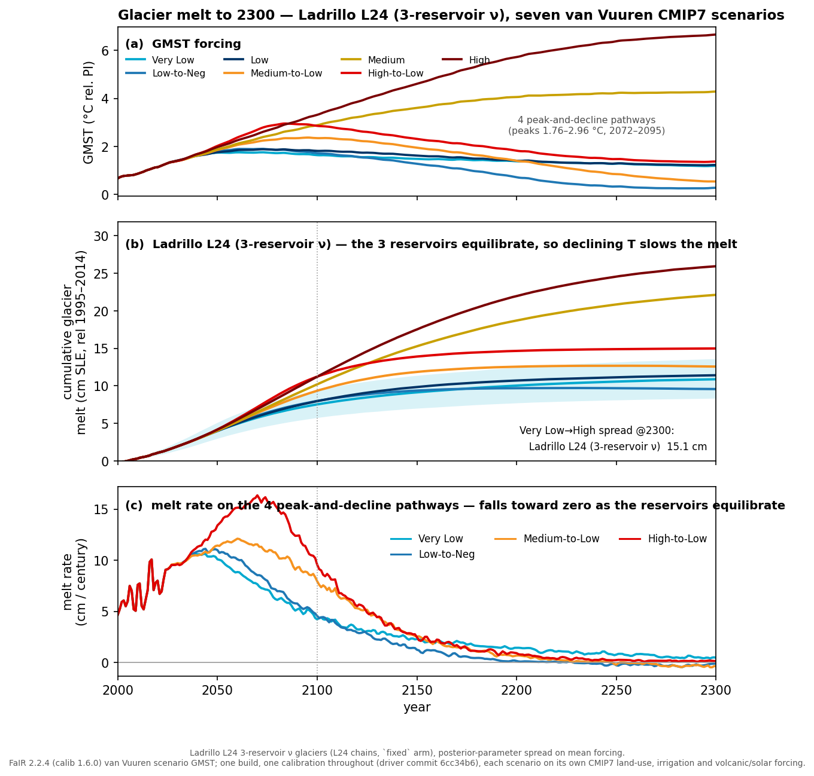
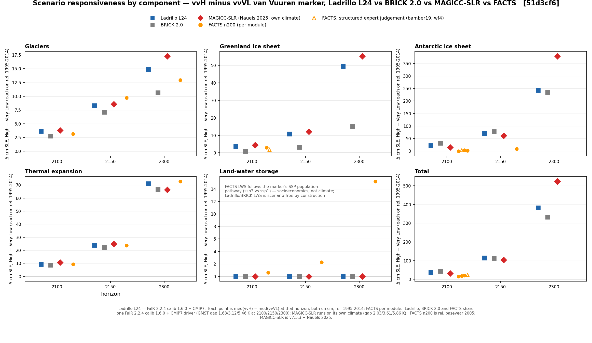
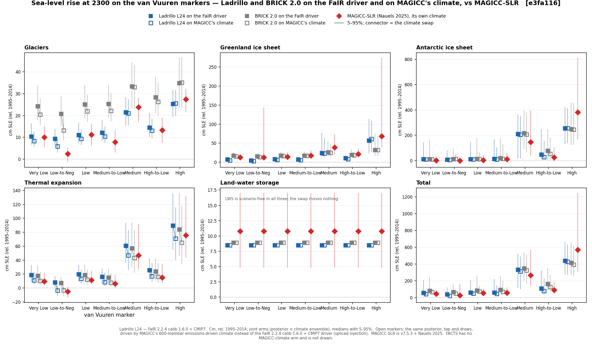

# Ladrillo Sea Level Rise Emulator

Ladrillo is a derivative of Tony Wong's BRICK 2.0 model. Ladrillo was developed by Marcus C Sarofim using the Claude model. The primary goals for Ladrillo were to add additional observational data, update the glacier module to better match observations and to halt melting for stabilization scenarios, update the Antarctic calibration approach to better match observations prior to 1980, and update the Greenland model to incorporate the different responses of surface melt balance and ice discharge.

Ladrillo occupies a distinct niche among current sea level emulators. Of the seven emulators in the SLEIP intercomparison, only three carry a hindcast of every component starting in 1900 or earlier: BRICK 2.0, SURFER, and MP25. Of these three, SURFER's historical total runs outside the observational range in SLEIP's own assessment, and MP25 is a statistical fit to the Frederikse reconstruction that projects only to 2100, leaving BRICK as the only SLEIP models which both runs 1900-2300 and matches observed total sea level. MAGICC-SLR and FRISIA start their ice sheets in 1990 and 2002, ProFSea starts in 2007, and the FACTS workflow starts in 2005. Some other limitations of other emulators are that FACTS's ice-sheet modules either extrapolate or sample from 21st-century projections and that MAGICC-SLR can only be run on MAGICC's own climate.

As a derivative of BRICK, Ladrillo and BRICK do share a similar niche. However, while Ladrillo generally keeps to BRICK’s design philosophy of physically based components calibrated on the historical record, it does depart from that philosophy in one place that observations cannot inform, namely a Greenland commitment above a threshold, informed by SICOPOLIS. Ladrillo also extended some of BRICK’s observational constraints (an Antarctic likelihood from 1900 rather than IMBIE's 1992–2017; Dangendorf, GlaMBIE, GRACE and Mouginot added), updated the Antarctic global-to-local amplification from the paleo-equilibrium ratio to a CMIP6 based one, added global-to-local amplification for Greenland and the glacier regions, and is calibrated to a current version of FaIR 2.2.4 (fair-calibrate 1.6.0, 841-member climate ensemble) rather than being coupled to SNEASY.

**Table 1.** Scope and calibration of the seven SLEIP emulators and Ladrillo. SLEIP entries from the SLEIP preprint (Tables 2 and 6, §3); FACTS's post-2100 behaviour read from its code. n.d. = not documented in SLEIP.

| attribute | BRICK 2.0 | FACTS | FRISIA | MAGICC-SLR | MP25 | ProFSea | SURFER | Ladrillo |
|----|----|----|----|----|----|----|----|----|
| Hindcast, all components | yes (1850) | no (2005) | partial¹ | partial¹ | yes (1900) | no (2007) | yes (1850) | yes (1850) |
| Calibrated on observations | yes | no² | mixed³ | no² | mixed³ | no² | no² | yes⁴ |
| Runs on an external climate (FaIR) | yes | yes | yes | no | GMST only | yes | no | yes |
| Climate-driven past 2100 | yes | TE, glaciers only⁵ | yes | yes | no⁶ | partial⁵ | yes | yes |
| Regional / relative sea level | yes / no | yes / yes | yes / no | no / no | yes / yes | yes / yes | no / no | no / no |

¹ Ice sheets start in 1990 (Greenland) and 2002 (Antarctica). ² Calibrated to process-model projections (ISMIP6, LARMIP, DeConto, SICOPOLIS, PISM, GlacierMIP2) or structured expert judgement. ³ Observations plus AR6 projections. ⁴ Except the above-threshold discharge channel (ISMIP6/SICOPOLIS) and the Antarctic amplification prior (CMIP6). ⁵ Ice-sheet modules extrapolate the 2080–2100 rate or sample 21st-century projections; ProFSea's Greenland uses the FACTS implementation. ⁶ A 2100 model, extended to 2300 by extrapolation.

**Table 2.** Component structure of the same eight emulators. Glacier inventories for BRICK 2.0, MAGICC and FACTS read from their parameter files and code; Farinotti 2019 gives 32.4 ± 8.4 cm SLE for all RGI regions. n.d. = not documented in SLEIP.

| attribute | BRICK 2.0 | FACTS | FRISIA | MAGICC-SLR | MP25 | ProFSea | SURFER | Ladrillo |
|----|----|----|----|----|----|----|----|----|
| Thermal expansion | ∝ OHC | ∝ OHC | ∝ OHC | 40 layers | ∝ GSAT | ∝ OHC | 3 layers | ∝ OHC |
| Glacier inventory at 2000 (cm SLE) | 37.7 (28–48)⁷ | 31.6⁸ | n.d. | ≈26–36⁹ | n.d. | n.d. | n.d. (50 preindustrial) | 29.0 ± 6.0¹⁰ |
| Glacier regrowth under cooling | no | no | no | yes | n.d. | no | yes | yes |
| Greenland SMB / discharge split | no | no | yes | yes | no | no | no | yes¹¹ |
| Antarctic ice sheet | DAIS | by workflow¹² | DAIS | parametric | parametric | statistical fit | ODE tipping element | DAIS, recalibrated |

⁷ Calibrated initial volume 42 cm (5–95% 32–52) at the 1850 start (Wigley and Raper's assumed 40 ± 10), less BRICK's own 4.0 cm of melt to 2000 (0.7 cm of it before 1900). ⁸ Cumulative-melt cap from AR5 Table 4.2, less the Antarctic periphery. ⁹ Equilibrium curves reach 35.6–45.1 cm at 1850 across the 15 tunes, less MAGICC's own 9.4 cm (5–95% 4.7–13.2) of melt to 2000. ¹⁰ Farinotti 2019 on Ladrillo's scope, which excludes RGI 05 (3.4 cm, included in the Greenland ice sheet). ¹¹ Two channels (SMB, discharge) in each of two basins. ¹² AR5 (parametric), LARMIP (response functions), DeConto (sampled), Bamber (expert judgement).

> **Vintage.** This document describes posterior L24. Units are cm. Two baseline windows are used: 1995-2005 for the hindcast section (FIG 1, the RMSE table, and the 2024 levels); and 1995-2014 for the projection sections. Model version FaIR 2.2.4 (fair-calibrate 1.6.0). Both hindcast arms are reproducible: every random seed is fixed and is recorded inside the output file read by each figure, so any number in this document can be regenerated precisely.

## Ladrillo Structural Updates

### GSIC

BRICK 2.0's glacier model uses a Wigley-Raper equation that is always melting when warmer than its preindustrial equilibrium. Ladrillo replaces it with a Mengel-style equilibrium volume `S_eq` driven by a Nauels-ν transient, which means that the total achievable melt is determined by the change in temperature from preindustrial while the rate of melt is driven by the warming relative to the new equilibrium. Ladrillo also splits all glaciers into three reservoirs and drives them with regional temperature.

**SLOWP — RGI regions 03, 09, 07, 06** (Arctic Canada North, Russian Arctic, Svalbard, Iceland). Ice volume at 2000: 12.7 ± 3.3 cm SLE (Farinotti 2019). Large, high-latitude, long relaxation time, and strongly amplified relative to global mean temperature (prior 2.50). This block dominates the glacier contribution in both the hindcast and the projections.

**FAST — 13 other RGI regions.** Ice volume at 2000: 9.4 ± 2.4 cm SLE. Smaller, faster-responding bodies with a smaller amplification (prior 1.45). This block equilibrates quickly enough that its committed volume is close to its realised volume through most of the record.

**RGI region 19 — Antarctic and Subantarctic periphery.** Ice volume at 2000: 6.9 ± 1.8 cm SLE. This block exists because the historical glacier target (Frederikse) assumes zero Antarctic-periphery melt, while the GlaMBIE series spliced in from 2019 onward includes it. Folding RGI 19 into either SLOWP or FAST would leave the model's hindcast scope mismatched. Keeping it separate lets the hindcast be evaluated on SLOWP + FAST while RGI 19 still contributes to projected totals. Its amplification prior (0.72) is also far below the other two, which is another reason to separate this region. Its only direct sea-level observation is GlaMBIE's own estimate of the region's 2000–2024 mean rate (0.049 ± 0.116 mm/yr, weak by construction: no gravimetry separates the periphery from the ice sheet), and the Farinotti inventory fixes its volume; its committed-loss curve and response time therefore rest on the GlacierMIP3 constraints that all three blocks share (the committed-loss fractions at 1.2, 1.5, 2.0 and 3.0 K and the response-time anchors at 1.5 and 3.0 K; Zekollari et al. 2025), which is why its response time is the least constrained in the model (80–3200 yr across the posterior, see the peak-and-decline discussion below).

These three blocks cover 18 of the 19 RGI regions; RGI 05, the Greenland Periphery, is excluded, as it is not included in Frederikse's glacier estimate but it is included in the Greenland ice-sheet module.

**Compared with other emulators.** BRICK 2.0 and Ladrillo now have completely different glacier modules. MAGICC and Ladrillo both use the formulation from Nauels 2017 Eq. 3; where they differ is the three regions used in Ladrillo. MAGICC's committed 1850 melt is 2.8–13.6 cm, Ladrillo's 6.3–14.6 cm. Ladrillo constrains the remaining glacier ice at 2000 to 29.0 ± 6.0 cm SLE based on Farinotti 2019 excluding RGI region 5 (Millan 2022 has similar glacier ice numbers). The full-RGI Farinotti value is 32.4 ± 8.4 cm. Other emulators' inventories at 2000: BRICK 2.0 has about 38 cm of ice remaining. FACTS's AR5 glacier module caps cumulative melt at 31.6 cm SLE, which every SSP5-8.5 sample reaches by 2300; MAGICC's equilibrium curves imply roughly 26–36 cm across their 15 tunes, after about 9 cm of melt over 1850–2000. These figures may not be fully comparable, since not every model covers all 19 RGI regions (e.g., MAGICC's Marzeion 2012 basis omits the Antarctic periphery (RGI 19) and Ladrillo the Greenland periphery (RGI 05)).

**Regrowth potential.** Ladrillo does have the potential to regrow glacier ice after cooling: MAGICC and SURFER are the only two sea level emulators from SLEIP that can do the same. The equations governing melt are:

    S_eq = max( a·(1 − exp(−b·(T − T_off))), 0 )        
    dS   = min( κ·|T − T_eq|^ν, 1 ) · (S_eq − S)        

**Regrowth limits.** MAGICC assumes that once ice committed to melt in 1850 has gone, it can't be regrown, but ice lost past that point can be. In theory, Ladrillo can regrow up until its 1850 ice extent (though no further), but that would require temperatures to drop below 1850 levels.

### Greenland

BRICK 2.0 treats Greenland as one body with one response channel responsive to global temperatures. Ladrillo replaces that with a two-channel, two-basin sheet that responds to local temperatures.

**Two channels (SMB / dynamic discharge).** Greenland melt occurs through surface-mass-balance response (50 year relaxation and present-day temperatures) and outlet/dynamic discharge (170 year relaxation). Two channels allow for that partition.

**Two basins.** The sheet is split into an active basin (SW+CW+CE+SE+NW) and a high basin (NO+NE), each carrying its own SMB/discharge channel pair, with sector shares scored against Mouginot.

**Amplification.** The ratio of Greenland warming to global warming is centred on its observed level (1.92, with a prior width taken from the CMIP6 spread) and falls with warming in proportion to the CMIP6 ratio, which declines from 1.50 to 1.28 over 0.75–2.75 K of global warming; holding it constant instead would raise Greenland by an additional 1 cm (SSP1-2.6, 2300) to 9 cm (SSP5-8.5, 2300) on the fixed-driver arm.

**Above-threshold discharge channel.** A third discharge channel on the high basin, enabling another melt mechanism above a threshold temperature: V = 564 cm, τ = 800 yr, onset 4.69 K, two stages, whole-sheet. It has zero effect below the threshold. It cannot be calibrated on observations, so the parameters were informed by ISMIP6 at 2100 and SICOPOLIS at 2300 and 3001. It is included in every projection here, contributing 35.1 cm to the SSP5-8.5 total at 2300 on the joint arm this document reports throughout, and nothing at SSP1-2.6 (exactly zero) or SSP2-4.5 (+0.04 cm). Without it, Greenland's SSP5-8.5 to SSP2-4.5 ratio at 2300 is 2.6, against 7.9–31.9 across the process-model literature.

**Compared with BRICK 2.0 and MAGICC.** The observed Greenland contribution rises quickly from the 1930s to the 1960s, nearly stalls from the 1960s to 1990, then accelerates; BRICK 2.0's single-channel response to global temperature yields an almost uniform rate across the century (0.46–0.49 cm/decade in every 30-year period against an observed 0.67 then 0.23), so it runs about 1 cm low through the 1950s–60s and 0.2 cm low since 2010. Ladrillo reproduces the shape because its surface-mass-balance channel responds to Greenland's local warming of about 1.2 °C during 1920–45 (in contrast to 0.2 °C globally), then local cooling through 1990 while the globe warmed. Meanwhile, the discharge channel is a steadier source of melt. MAGICC similarly splits Greenland into SMB and SID and parameterises against SICOPOLIS. MAGICC’s Greenland melt module starts in 1990, and underestimates melt relative to observations over the 1990-2026 period.

## Ladrillo Calibration Data Updates

**Table 3.** Observational inputs added or replaced relative to BRICK 2.0, with the version of each as used in the calibration.

| data source | vintage / version as used | what it constrains |
|----|----|----|
| Dangendorf 2024 GMSL | Zenodo `10.5281/zenodo.10621070`¹³ | The total, replacing the CSIRO (Church & White 2011 lineage, 2015 update) reconstruction BRICK 2.0 was calibrated to. In L24 the total is not a likelihood term (it was dropped so that RGI 19 is constrained by its own observation rather than by budget closure); Dangendorf is the comparison target for the total in FIG 1 and Table 4. |
| GlaMBIE glacier series (2019 onward) | Dataset 1.0.0, DOI `10.5904/wgms-glambie-2024-07`; paper `10.1038/s41586-024-08545-z`¹⁴ | The modern glacier rate, spliced onto Frederikse. It includes Antarctic-periphery melt (RGI 19) which is excluded by Frederikse. |
| JPL GRACE / GRACE-FO mascons | Release RL06.3Mv04 CRI, DOI `10.5067/TEMSC-3JC634`¹⁵ | Land-water storage. GRACE data run 2019–2023; the 2023 value is then held constant through 2026, the end of the calibration window. In projections LWS follows BRICK's stochastic land-water module from 2019. |
| Mouginot Greenland sector shares | `10.1073/pnas.1904242116`, Supplementary Dataset S2 (`pnas.1904242116.sd02.xlsx`, sheet "(2) MB_GIS"). No dataset version is published | The basin split, as a shares term rather than a level. |
| Rignot 2019 Antarctic SMB, area-corrected ×0.888 | *PNAS* 116:1095; 2098 ± 133 Gt/yr over the 1979–2008 climatology, entered as published values | The absolute Antarctic flux scale. SMB minus discharge is well constrained at −145 ± 15 Gt/yr but each flux individually has high uncertainty (±505/±509), so Rignot anchors the pair. |
| Glacier inventory likelihood + a 19th-century flow constraint, `S(1900) − S(1850) ~ N(2.0, 0.9)` cm SLE | Inventory: Farinotti 2019 (*Nat. Geosci.* 12:168) reconciled per Hock 2023, at the RGI ~2000 outline epoch, entered as published values; region polygons GTN-G Glacier Regions 2023, DOI `10.5904/gtng-glacreg-2023-07`, on the RGI6 scheme. 19th-c flow: Leclercq/Oerlemans/Cogley 2011, DOI `10.1007/s10712-011-9121-7` | The absolute inventory and the pre-observational flow. |
| CMIP6 regional amplification (34–41 models) | Pangeo/Google-Cloud CMIP6 zarr catalogue¹⁶ | Prior on the Antarctic amplification; the warming-dependence and prior width of the Greenland amplification (its level is observed). The glacier-region amplifications are fitted to observations; the CMIP6 glacier panel served as a check only. |
| Paleo constraints on DAIS geometry, in a standardised correlation form | `DAISfastdyn_calibratedParameters_gamma_29Jan2017.nc`, the 16-parameter / 800,000-member ensemble shipped with MimiBRICK¹⁷ | The seven freed geometry parameters (below). |
| *(not a calibration target)* IGCC 2025-indicators GMSL | Tag `v2026.06.02`, data DOI `10.5281/zenodo.20499280`; paper Forster et al. 2026, `10.5194/essd-18-3889-2026`¹⁸ | Shown on FIG 1 as an independent consensus check on the total. |

¹³ GMSL derived from `Fields.nc`, not the record's `Global.nc` (mis-written upstream), and validated against a corrected `_v2.nc` supplied by S. Dangendorf (pers. comm., 2026-08-07). ¹⁴ Acquired 2026-06-13. ¹⁵ Granule `200204_202606`. ¹⁶ Fetched 2026-07-21 to 2026-08-24 (Greenland panel 2026-08-18, glacier panel 2026-08-23); member ID recorded per model and the panel pinned to the fetched files, so a later catalogue change cannot swap the ensemble. ¹⁷ sha256\[:16\] `0b53b45e2422563b`; extracted 2026-08-24. ¹⁸ md5 `8ae5ac0041e26351b9f497f969bd0dab`.

**Deliberately removed: IMBIE.** Dropped from the Antarctic likelihood to avoid double-weighting the same mass-balance information already entering through other terms.

**Forcing.** FaIR 2.2.4 (fair-calibrate 1.6.0), driven by CMIP7 historical emissions 1750–2023 spliced at 2023.5 to MESSAGE-GLOBIOM SSP2-4.5 and harmonized per species. The calibration's fit window runs to 2026, so its last three years are driven by the scenario rather than by the historical emissions inventory (an effect of only about 0.002 W/m²).

## Ladrillo Calibration Approach Updates

58 parameters are sampled: 17 Antarctic, 9 Greenland, 19 glacier, 13 remaining (thermal expansion, two discrepancy bases of two coefficients each, and four AR(1) noise pairs). Four Antarctic changes distinguish Ladrillo's calibration from BRICK 2.0's — the three described below, plus an SMB likelihood term anchoring the Antarctic flux scale to Rignot 2019. The Antarctic changes have not been tested individually, so the AIS changes cannot be formally attributed by parameter.

**The seven DAIS geometry parameters.** The seven parameters (`ais_mu`, `ais_bedheight0`, `ais_slope`, `ais_iceflow0`, `ais_precip0_LOG`, `ais_runoff_Ton`, `ais_c`) are freed under a joint paleo prior. Ladrillo's pre-1990 Antarctic hindcast is far closer to the record than BRICK 2.0's (see Figure 1 and Table 4). A key driver of differences between BRICK and Ladrillo is the observational constraint, since BRICK’s Antarctic likelihood is IMBIE 1992–2017 while Ladrillo fits an Antarctic series from 1900.

**The runoff line is sampled in its identified direction.** `h0` and `c` enter only as `hR = h0 + c·T_ant` with a correlation ridge. Ladrillo samples `T_on = −h0/c`, the runoff onset temperature, which is what the data constrain.

**Antarctic amplification is a key parameter.** DAIS maps global to Antarctic surface temperature through one ratio. Stock DAIS hard-codes 1.196, the inverted paleo regression which is an equilibrium amplification factor. Ladrillo samples the transient ratio with a prior of N(1.09, 0.180), equal to the CMIP6 ratio and between-model spread. The parameter’s leverage is strongly scenario-dependent: a one-sigma change moves Antarctic sea level at 2300 by about 58 cm on SSP2-4.5 (roughly 23% of that scenario's total) but only about 24 cm on SSP5-8.5 (under 5%), because SSP5-8.5 is already past the thresholds where amplification matters. Reverting to DAIS's 1.196 on the shipped posterior (fixed-driver arm) adds 17 cm to the SSP2-4.5 total at 2100 and 42 cm at 2300 (9 and 22 cm on SSP5-8.5).

**Discrepancy terms.** The glacier and thermal-expansion series each carry a two-coefficient model-discrepancy term δ(t), a low-order polynomial in time added to the modelled series before it is scored against the observations. Each basis is orthogonalised against a constant, so δ(t) cannot absorb a level shift, and against the shape the module itself can produce (the ocean-heat path for thermal expansion; the early-century observational ramp for glaciers), so it can only describe structure that rescaling the driver cannot. The basis vectors have unit RMS over the fit window, so each coefficient is an RMS discrepancy in cm, with a N(0, 0.5 cm) prior. Three of the four coefficients are centred near zero in the posterior (medians 0.01–0.04 cm); the first thermal-expansion coefficient is not (0.26 cm, 5–95% 0.09–0.40 cm). FIG 1 and Table 4 show the bare modules without δ(t), which keeps the comparison with BRICK 2.0, which has no such term, like-for-like.

**Sampler.** The posterior is sampled with a robust adaptive Metropolis algorithm (Vihola 2012), whose proposal covariance is adapted during the run toward a 0.234 acceptance rate from a seed taken from an earlier tuning chain. Four chains of 2,000,000 iterations are run; the first half of each is discarded and the 4,000,000 retained draws are thinned evenly to the 10,000-member posterior used for projection. The chains start over-dispersed: each begins from a different retained draw of an earlier tuning chain, chosen at the 2nd, 35th, 65th and 98th percentiles of `ais_iceflow0`, the slowest-mixing direction of the posterior, so that the between-chain comparison below can detect posterior mass a single chain would not reach in the run. (Starting from a jittered common point was tried and rejected: a jointly perturbed Antarctic geometry leaves the feasible region even when every marginal is within its bounds.)

**Convergence criterion.** Convergence is assessed with R̂, the Gelman–Rubin potential scale reduction factor (here the rank-normalised split-R̂ of Vehtari et al. 2021): the ratio of the pooled-chain spread of a quantity to its mean within-chain spread, which approaches 1 when the four chains have mixed into the same distribution and exceeds it while they still sample different regions. The parameter-level gate is R̂ < 1.05 with an effective sample size above 400; 39 of the 58 parameters pass it. The 19 that fail are concentrated in the Antarctic block (the geometry ridge and the ocean-temperature parameters; `ais_iceflow0` R̂ = 1.26, `antarctic_alpha` 1.28) and in Greenland's slow channel, directions that are weakly identified and compensate for each other. L24 is therefore accepted on the deliverable-level criterion: projected sea level converges (R̂ = 1.008 at 2100 and 1.011 at 2150 on SSP2-4.5, with an effective sample size of about 1050 on the 1,600 thinned draws used for the diagnostic).

## Ladrillo Observational Comparison

**FIG 1.** Component hindcasts against the observations, 1900–2026, in cm relative to a 1995–2005 baseline. Ladrillo L24 (solid, with its 5–95% band) and BRICK 2.0 (dashed) are both run starting in 1850, plotted from 1900, and driven by the same ssp245harm forcing. The Greenland panel also shows MAGICC-SLR (v7.5.3 + Nauels 2025, dotted, with its 5–95% band) from 1991, the first year its Greenland module is active; it runs on its own emissions-driven climate. The total panel also shows IGCC 2025-indicators GMSL, which is not a calibration target. On the thermal-expansion panel the hatched band above the observation is the most the ocean below 2000 m could shift a 0–2000 m observation (IGCC deep-ocean heat times the observed upper-ocean expansion coefficient; an upper bound). Land-water storage is observational — neither model predicts it, so the land-water panel shows the observed series alone and both totals include it.

**Table 4.** RMSE of the Ladrillo L24 median against the observations, divided by BRICK 2.0's, by component and window; below 1 means Ladrillo is closer. Components are scored against their own targets and the total against Dangendorf 2024, all in cm relative to a 1995–2005 baseline.

| component         | 1900–1919 | 1920–1949 | 1950–1992 | 1993–2026 | full      |
|-------------------|-----------|-----------|-----------|-----------|-----------|
| Antarctica        | **0.003** | **0.005** | **0.010** | **0.676** | **0.019** |
| Greenland         | **0.110** | **0.102** | **0.054** | **0.263** | **0.085** |
| Glaciers          | **0.431** | **0.371** | 1.061     | **0.408** | **0.419** |
| Thermal expansion | **0.703** | **0.723** | 1.107     | 1.519     | **0.820** |
| **Total**         | 4.138     | 1.369     | **0.519** | **0.892** | 1.172     |

Ladrillo is closer than BRICK 2.0 on every component in the two earliest windows yet further from the total there, and the reason is compensating error. Over 1900–1919 BRICK's Antarctic undershoot (−2.90 cm) and glacier overshoot (+3.28 cm) are opposite in sign and nearly equal, so its four component biases sum to +0.62 cm out of 7.57 cm of absolute error. Ladrillo's biases are small but almost all positive, summing to +1.95 cm out of 1.97 cm. The same pattern holds over 1920–1949. The observational budget's own non-closure is common to both arms and small in these windows (−0.31 and +0.17 cm), so it cannot account for the difference. The component rows are therefore the skill statement; the total row additionally reflects whether a model's errors cancel after calibration. Ladrillo uses the observed LWS time series directly, whereas native BRICK subtracts LWS prior to calibration, so its components represent sea level excluding LWS; the observed series is added to both totals to put them on the same basis as the LWS-inclusive observational total. Separately, BRICK 2.0 runs on its own published posterior against our extended targets, so part of its bias is target vintage.

Ladrillo is closer to the observations than BRICK 2.0 on every ice component in every window except glaciers over 1950–1992, and the gains are largest in the early eras. Cumulative total sea level rise, comparing the 1900–1904 mean with the 2020–2024 mean: observed +21.00 cm, Ladrillo +19.84, BRICK 2.0 +21.34 — Ladrillo undershoots by 1.2 cm, BRICK overshoots by 0.3. Over the shorter, more recent window — the mean over 2022-2024 relative to the 1995–2005 baseline — both models still run high, but only slightly: observed +7.81 cm, Ladrillo +8.16 (+0.36) and BRICK 2.0 +8.34 (+0.54), with IGCC's independent GMSL estimate between them at +8.21. On the 2006–2025 rate of total sea level, the metric the SLEIP intercomparison reports, Ladrillo yields 0.374 cm/yr and BRICK 2.0 0.389 against 0.392 for the observational target and 0.399 for IGCC (same linear fit, same window).

**For thermal expansion Ladrillo overshoots, and the cause is FaIR’s ocean heat.** In both Ladrillo and BRICK thermal expansion is exactly proportional to ocean heat, despite Ladrillo's expansion coefficient being within 3% of the value the observations imply. On the FaIR driver both models overestimate the 1993–2026 thermal-expansion rate (Ladrillo 1.27×, BRICK 2.0 1.17×), because FaIR's ocean heat uptake over that period is 1.22–1.29× the observed 0–2000 m products the target is built from. That excess has two parts of similar size. FaIR's ocean heat is full-depth while the steric target is 0–2000 m, and IGCC's own accounting puts the ocean below 2000 m at 10% of the heat uptake, so a full-depth model is expected to run about 1.10× a 0–2000 m target; the hatched band on FIG 1 shows the most this could add to the observation (0.3 cm by 2024, almost 40% of Ladrillo's 0.8 cm excess). The remaining 1.10× is FaIR's full-depth heat uptake exceeding IGCC's full-depth estimate. Driving Ladrillo with observed 0–2000 m ocean heat reproduces the steric record within 4% in every era.

## Ladrillo Projection Comparison

We report comparisons to both the van Vuuren scenarios and the SSPs. All Ladrillo bands are the joint (posterior × FaIR-forcing) arm. Bars are 17–83% (thick) and 5–95% (thin). Ladrillo, BRICK, and FACTS have the same source of climate uncertainty (Ladrillo and BRICK 2.0 from the 841 FaIR configs with the same cubes, splice pivot, and pair seed; FACTS from 200 of the same configs, plus its modules' own sampling) whereas MAGICC-SLR relies on its own 600-member AR6 ensemble. FACTS is reported relative to base year 2005, treated as comparable to the 1995–2014 mean. FACTS's three emulandice workflows (Gaussian-process emulators of ISMIP6 and GlacierMIP2 output) end in 2100 by construction, so they appear only at that horizon on both scenario sets; its four other workflows run to 2300.

On glaciers, Ladrillo and MAGICC-SLR share the Nauels 2017 transient, so differences between Ladrillo and MAGICC reflect differences in reservoir count, driver, and posterior; BRICK 2.0 and FACTS have independent modules. For Greenland all four formulations differ. For Antarctica Ladrillo and BRICK 2.0 share DAIS for the ice sheet though with different calibration sets, while FACTS (LARMIP, DeConto, Bamber, AR5 and emulated ice-sheet modules) and MAGICC-SLR differ. Ladrillo and BRICK 2.0 both use a proportional relationship between thermal expansion and ocean heat while FACTS uses a two-layer expansion model and MAGICC-SLR uses a 40-layer approach.

**FIG 2.** Ladrillo L24 compared against BRICK 2.0, FACTS and MAGICC-SLR across the seven van Vuuren scenarios at 2100, by component. Each of FACTS's unique modules is shown; the Total panel shows its seven workflow totals as one bracket spanning their medians (thin line: the union of their 5–95%). The three emulandice workflows end at 2100; the other four differ only in the Antarctic module. At 2150 and 2300 (FIGs 3, 4 and 9) only FACTS's climate-driven modules are drawn.

**FIG 3.** The same comparison at 2150.

**FIG 4.** The same comparison at 2300.

**FIG 5.** Component trajectories across the van Vuuren scenarios, joint band, Ladrillo relative to BRICK 2.0.

**FIG 6.** Ladrillo glacier contribution to 2300 across the seven van Vuuren scenarios: GMST forcing (a), cumulative glacier melt (b), and the melt rate on the peak-and-decline pathways (c). Regrowth appears when temperature declines below the reservoir equilibrium.

**FIG 7.** Scenario responsiveness by component: the High-minus-Very-Low difference of medians at 2100, 2150 and 2300 for each model, FACTS per module (open triangles: structured expert judgement). Ladrillo, BRICK 2.0 and FACTS share the FaIR driver (High − Very Low GMST gap 1.7/3.1/5.5 K at the three horizons); MAGICC-SLR responds to its own climate (2.0/3.6/5.9 K).

FACTS results are shown for all modules through 2100, but past 2100 only the modules that explicitly respond to the FaIR climate driver are shown. Its Greenland module (FittedISMIP) is an emulator fitted to 2015–2100 ISMIP6 runs whose rate carries an explicit quadratic term in time; FACTS extrapolates it linearly after 2100, so letting it run on the temperature path results in High-to-Low Greenland rising from 47 to 112 cm by 2300 while the climate cools. The Bamber and DeConto modules select their projections from the temperature integrated over 2000–2099 with the AR5 Antarctic dynamics term as a prescribed function of time, and LARMIP's response functions are 200 years long and zero beyond, so by 2300 it has forgotten every pre-2100 forcing year. Modules whose components are not climate-driven at a given horizon, and every workflow total that depends on those modules, are therefore dropped from that horizon: at 2150 FACTS is shown for glaciers, thermal expansion, land-water storage and LARMIP Antarctica; at 2300 for glaciers, thermal expansion and land-water storage only. The SLEIP intercomparison introduction notes that some AR6 methods cannot project beyond their 2100 training horizon; so its 2300 FACTS values are presumably these extrapolations and not a climate-driven alternative.

One further feature of the comparison is worth highlighting. MAGICC-SLR's Greenland band for the Low-to-Negative scenario reaches 144 cm at 2300 (95th percentile) compared to 25 cm for the Low scenario, although the medians are 13 and 14 cm: for MAGICC's own climate the Low-to-Negative scenario cools below preindustrial by 2300, and MAGICC's Greenland surface-mass-balance parameterisation, fitted for warming, turns positive there. The members with the strongest cooling (−1.5 to −2 K) give the largest Greenland melt (up to +343 cm from surface mass balance alone).

### SSP comparisons

The SSP comparisons have similar results to the van Vuuren comparisons. Because SSP5-8.5 is

**FIG 8.** The SSP comparison at 2100.

**FIG 9.** The SSP comparison at 2300. The FACTS AR5 glacier module is completely melted (31.6 cm SLE) under SSP5-8.5.

**FIG 10.** Total sea level by SSP, Ladrillo L24 joint band. Totals at 2300: 72.6 cm (SSP1-2.6), 249.2 cm (SSP2-4.5), 516.7 cm (SSP5-8.5).

### Ladrillo compared to MAGICC on MAGICC's own climate

Comparing two sea-level models on different climate drivers confounds the module with the forcing. Ladrillo and BRICK 2.0 were therefore re-run on MAGICC's climate to test which differences were due to sea level module versus climate module.

**FIG 11.** Ladrillo L24 and BRICK 2.0 at 2300 on the seven van Vuuren scenarios, each drawn twice — on the shared FaIR driver (filled) and on MAGICC's own 600-member climate (open), with the connector showing the swap — against MAGICC-SLR. Same posterior, above-threshold channel and draws on both climates; FACTS has no MAGICC-climate arm and is not drawn.

### Physical intuition — how Ladrillo behaves by scenario class

**High scenarios.** For the High scenario, the three models are fairly similar at 2100 (Ladrillo 72 cm, BRICK 2.0 82, MAGICC-SLR 62). By 2300 Ladrillo and BRICK 2.0 sit together (439 and 414 cm, median) well below MAGICC-SLR (570 cm), and the gap is due to Antarctica: 255 and 248 cm against MAGICC's 382. Driving both on MAGICC's own climate actually decreases their totals by 15–22 cm mainly due to thermal expansion (to 425 and 393; FIG 11), so the difference is the ice-sheet modules, not the climate. Ladrillo's 2300 Antarctic spread is dominated by the prior for `antarctic_lambda`, the DAIS fast-dynamics rate; BRICK 2.0 samples the same parameter from the same fast-dynamics ensemble (mean 0.0105, sd 0.0033 in Ladrillo; 0.0104, 0.0036 in BRICK 2.0), which is why the two Antarctic spreads are alike (5–95% widths of 329 and 405 cm at SSP5-8.5 in 2300).

**Low scenarios.** Ladrillo sits at the low end of the comparison set on level — at vvVL its 2300 total median is 58 cm, above only MAGICC-SLR's 46 cm and below BRICK 2.0's 81. On spread it is narrower than BRICK 2.0 on every component and narrower than the FACTS glacier and thermal-expansion modules (the only FACTS modules drawn at 2300); MAGICC-SLR is the narrow outlier throughout (2300 total 5–95% width 67 cm against Ladrillo's 163 and BRICK 2.0's 182).

**Peak-and-decline scenarios.** The glacier change is evident here because it allows regrowth, though on Ladrillo's own FaIR climate that regrowth is very small: measured from each scenario’s peak to 2300, it reaches only 0.18 cm at vvLN and 0.13 cm at vvML, and is essentially nil on the other scenarios. The capacity is larger than the realised amount — driven instead by MAGICC's colder climate, the same module regrows 2.2 cm at vvLN — so what limits regrowth here is how far the scenario cools, not the module's willingness to regrow.

**MAGICC regrows substantially more than Ladrillo.** About ¾ of the regrowth difference is model structure and ¼ the climate module. Measured on realised regrowth (peak-to-2300) at vvLN, the scenario where regrowth is largest: MAGICC regrows 8.59 cm against Ladrillo's 0.18 cm, and driving Ladrillo's module with MAGICC's own climate decreases the gap by 2.02 cm. When driving the two models with MAGICC’s own temperature, Ladrillo’s committed equilibrium regrowth is also somewhat less than MAGICC’s, but MAGICC reaches its regrowth limits in the two coldest van Vuuren scenarios. So while the gap with MAGICC is mainly a rate effect (at 1.5 K the SLOWP and RGI 19 regions have median response times of ~270 yr and ~470 yr, the latter very poorly constrained at 80–3200 yr across the posterior; all three blocks respond about three times faster at 3 K) this rate effect is compounded by an equilibrium effect.
