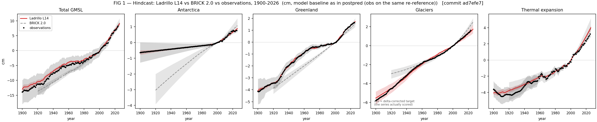
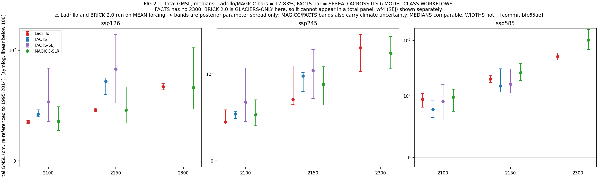

# Ladrillo (L14) — model description, evaluation, and open concerns
### DRAFT for Marcus. Technical content complete; argument and voice are yours.

**Status.** Ladrillo posterior **L14** is the canonical arm (promoted 2026-08-20).
Prior lineage: MimiBRICK v2.0.0 → Ladrillo. Basis for every projection number below:
**cm, re-referenced to 1995–2014**. Commit `bfc65ae`. Frozen comparison inputs are
hashed in `benchmark/reference/_fixed/manifest.json`.

> **[MARCUS — framing paragraph goes here.]** What Ladrillo is for, and why a standalone,
> global-only, calibrated SLR emulator is the right object for this use. The two positioning
> claims you named — *standalone* (vs MAGICC, which SLR rides inside) and *simpler, global-only*
> (vs FACTS) — belong here in your words.

---

## 1. What changed since BRICK 2.0, and why

Changes to the model and its calibration. Approaches that were tested and discarded are
recorded in `CHANGELOG.md`, not here.

### 1.0 How every reservoir is driven: regional, not global, temperature

Sea-level components do not respond to global mean temperature — they respond to the
temperature over the ice. Every reservoir in Ladrillo is therefore driven by a *regional*
temperature, built in two pieces:

* **Over the observed record**, the regional driver is an **observed** temperature series —
  for the glacier blocks, area-weighted HadCRUT5 over the glaciers actually in each block.
* **Beyond the observations**, the regional driver is extended as
  **amplification factor × global mean temperature**, and that amplification factor is
  **sampled with a prior, not fixed** — so its uncertainty propagates into the projection.

Where the amplification prior comes from differs by component, and this is worth stating
plainly because it is the main place the model imports outside information:

| component | amplification prior | source |
|---|---|---|
| **Glaciers** (3 blocks) | R19 0.72 ± 0.15, SLOWP 2.50 ± 0.45, FAST 1.45 ± 0.15 | **Observed temperature products.** Centred near HadCRUT5, σ from the spread *across* Berkeley Earth / HadCRUT5 / GISTEMP, hard bounds = the cross-dataset range (e.g. SLOWP: BE 1.82, HadCRUT 2.48, GISTEMP 3.46). |
| **Greenland** | `gis_amp`, sampled, with an `amp(GMST)` law | Zone-and-window keyed prior file; the law lets the ratio vary with warming rather than holding one number. |
| **Antarctica** | `ais_gmst_amp` ~ N(0.95, 0.10) | **CMIP6** (Xie et al. 2022, Sci Rep 12:16548), a polar-cap temperature ratio. |

> ⚠ **What extending the amplification factor forward does and does not assume.** For glaciers
> and Antarctica the amplification factor is a **single constant**, not a time-varying quantity:
> the glacier factors are a through-origin fit of regional on global temperature over
> **1901–2024**, and Antarctica's is one CMIP6-derived number. Extending them forward assumes
> **the historical regional-to-global ratio continues to hold**.
>
> And the uncertainty attached to that assumption is **narrower than it may appear**: the σ on
> each glacier factor is the **disagreement between observational products about the historical
> slope** (SLOWP: Berkeley Earth 1.82, HadCRUT5 2.48, GISTEMP 3.46), *not* a measure of how much
> the ratio varied over history, and *not* an estimate of how much it might change in future.
> **So nothing in the glacier or Antarctic priors covers the possibility that the amplification
> itself shifts under strong warming** — sea-ice loss, circulation change, or a saturating
> polar response would all violate it, and the band would not widen.
>
> Two things bound this. **Greenland is the exception**: it carries an `amp(GMST)` law, so its
> ratio *does* vary with warming level, and its prior file holds "early"/"modern" window arms, so
> the temporal-stability question has at least been posed there. **For Antarctica the constant is
> evidence-based**: a warming-dependent law was tested against corrected CMIP6 data and is not
> supported (unresolved on both scenarios, with opposite signs). **For glaciers the test has now been run
> (2026-08-27) and the assumption survives.**
>
> **The glacier early/modern test.** Split on Greenland's own window convention (early
> 1901–1960, modern 1961–2024), the fit *appears* strongly non-stationary: R19 moves +0.42
> (z = +3.5) and SLOWP −1.24 (z = −4.4), both ~2.8 prior σ — **and in opposite directions,
> which is the tell.** Both are an artefact. The fit is through-origin, forcing both series
> through zero at 1850–1900, so a small constant offset in the early window — where global
> anomalies are weak (rms 0.24 K against 0.77 K) — is divided by a small denominator and
> appears as a slope change. Refitting with a **free intercept** collapses every block's
> window difference to **≤0.12, under 1 prior σ**. And the fit the model actually uses is
> already modern-weighted: leverage goes as GMST², so the 1901–2024 fit sits within
> **0.23σ** of a modern-only fit. ⇒ **No material non-stationarity, and the shipped factor
> is effectively the modern-era one — the right basis for a projection.** What no historical
> test can bound is a *future* change in the ratio.
>
> **Could CMIP6 inform the glacier factors instead?** It could, and it would move them.
> Against 43 CMIP6 models the observed amplification sits **below** CMIP6's for every block
> at **every one of five baseline frames** (obs ÷ CMIP6 = 0.71–0.99, range ≤0.28, never
> reversing) — unlike Greenland's offset, which *reverses sign* across frames and is
> therefore a frame artefact. Adopting CMIP6 would raise R19 by **+0.15** and SLOWP by
> **+0.36**, and widen the priors **1.2–1.6×**. That is the same fit-versus-provenance
> tension settled for the Antarctic amplification in favour of fit; for glaciers it is
> **not** settled, and it is a live choice rather than a defect.
>
> **Could observations anchor the level and CMIP6 supply the future *shape*?** Greenland already
> works this way — a projection-side amplification law anchored to an observed level — so the
> pattern exists. For glaciers it was tested (2026-08-28, `scope_glac_amp_law_form.py`, same
> method that settled the identical question for Antarctica: per-model secant regressed on ΔT,
> restricted to ΔT ≥ 1 K, 43 models):
>
> | block | CMIP6 slope /K | z | worth over 1–4 K | ÷ between-model sd | reading |
> |---|---|---|---|---|---|
> | **SLOWP** | −0.0003 | −0.01 | −0.001 | 0.00 | **flat — no shape to borrow** |
> | R19 | −0.0249 | −2.54 | −0.075 | 0.33 | resolved but small vs the spread |
> | **FAST** | +0.0288 | +3.02 | **+0.087** | 0.66 | **a real shape** |
>
> **Only FAST has a shape worth the name, and even there it is 0.58 prior σ across the entire
> 1–4 K range — inside the uncertainty already carried.** SLOWP, which dominates the glacier
> contribution, is dead flat (z = −0.01). And the term the hybrid would *not* fix is the larger
> one: the level offset between CMIP6 and observations is **3.4× the shape for R19 and 383× it
> for SLOWP.** So the hybrid buys a second-order refinement while leaving the first-order
> disagreement (C10) untouched. **Recommended: not worth building for glaciers** — the same
> conclusion, by the same test, that stopped `amp(ΔT)` being built for Antarctica.
> ⚠ FAST is the one place a future case could be made, and it is the block where a law would
> matter least: it is the smallest-amplification, fastest-equilibrating block.
>
> **What the forward splice actually is, since "linear" and "constant amplification" are the
> same choice.** Beyond the observations the driver is
> `T_reg(t) = amp_b × GMST(t) + offset`, with the offset fixed so the line meets the **observed
> 11-year mean at the splice point** (`extend_obs`, anchor-preserving). So the *level* is the
> observed one — observations are not overwritten by a model — and only the forward *increment*
> is modelled. That extrapolation is **linear in GMST, not in time**, and the amplification is
> **already held constant**: a constant amplification is exactly what makes the relation linear.
> The alternative is not "constant instead of linear" but `amp(ΔT)`, which would make the
> relation **curved**.
>
> **And CMIP6 supports the constant.** SLOWP — the dominant block — is flat (z = −0.01); R19's
> slope is resolved but a third of the between-model spread; only FAST argues for curvature. If
> CMIP6's slopes were exactly right, holding amplification constant to 4 K would bias regional
> temperature by **+0.30 K (R19), +0.00 K (SLOWP), −0.35 K (FAST)** — and **R19 and FAST point
> opposite ways, so they partly cancel in the glacier total.** That is the case for leaving the
> extrapolation as it is.

### 1.1 Glaciers — from one saturating reservoir to three regional ones

BRICK 2.0's glacier model was a **single reservoir that was either not melting or committed to
full melt**: the Wigley–Raper formulation saturates, so it cannot reproduce the observed
20th-century trajectory and the scenario spread at the same time.

| change | justification |
|---|---|
| Wigley–Raper → **Mengel-style equilibrium volume `S_eq` + Nauels-ν transient** on regional temperature (`extB3`) | Separates *how much* ice is committed at a given warming from *how fast* it gets there — the two things the single saturating reservoir conflated. |
| **Three reservoirs: SLOWP / FAST / R19** (`extC`) | See below — the third is not a third timescale. |
| **Sampled `gic_amp`** per block (§1.0) | The regional amplification was pinned at one number with no uncertainty, and it is a first-order control on the projection. |
| **Glacier inventory likelihood** + 19th-century flow constraint `S(1900) − S(1850) ~ N(0.020, 0.009)` m SLE | Anchors the absolute inventory and the pre-observational flow, neither of which the 20th-century transient identifies on its own. |

**Why three reservoirs and not two.** Two of the blocks are the expected pair of response
timescales, split by region:

* **SLOWP** = RGI regions 03, 09, 07, 06 (Arctic Canada North, Russian Arctic, Svalbard,
  Iceland) — large, high-latitude, long-τ, and strongly amplified (prior 2.50).
* **FAST** = the remaining 13 regions — smaller, faster-responding, weakly amplified (1.45).

**The third block, R19 (Antarctic and Subantarctic periphery), exists for an *observational
scope* reason, not a dynamical one.** The historical glacier target (Frederikse) **assumes zero
Antarctic-periphery melt**, while the GlaMBIE splice used from 2019 onward **includes it**. If
R19 were folded into either other block, the model's hindcast scope would no longer match the
scope of the series it is scored against. Keeping it separate lets the hindcast be evaluated on
`SLOWP + FAST` — exactly the target's scope — while R19 still contributes to projected totals.
Its amplification prior (0.72) is also far below the other two, so it is not physically
interchangeable with them either.

### 1.2 Greenland — one channel to a constrained multi-basin sheet

| change | justification |
|---|---|
| **Two-channel (fast/slow) module** wired into the joint calibrator | A single channel cannot carry outlet/dynamic response and surface-mass-balance response with different time constants. |
| **Channel ordering enforced** (`--gis-ordered`) | The fast channel must be faster than the slow one. Without the constraint the two are exchangeable and the posterior can invert them, which is not a physical solution. |
| **`gis_amp` sampled, with an `amp(GMST)` law** | It was pinned, and it is the dominant control on the 2100 Greenland projection. The law reduced the G4 spread 9.80 → 7.37 cm. |
| **Multi-basin sheet** with sector shares and a pinned reference basin | Greenland does not respond as one body. The reference basin is pinned because the common mode of the basin shares is *exactly* degenerate — pinning removes an unidentified direction rather than adding information. |
| **High-basin volume tap**: V = 5.64 m, τ = 800 yr, onset 4.69 K, whole-sheet, 2 stages | Represents post-2100 commitment above a threshold. Off by default and port-tested; it does not fire on scenarios that stay below the onset. |

### 1.3 Antarctica — freed geometry, and an identified runoff line

| change | justification |
|---|---|
| **7 DAIS geometry parameters freed** under a joint paleo prior (standardised correlation form, cond 2.75 vs 5.2e13 raw) | **This is the change that fixed the pre-1990 Antarctic melt.** See below. |
| **Runoff line sampled in its identified direction**: `T_on = −h0/c` instead of (h0, c) | h0 and c enter the model only as `hR = h0 + c·T_ant`, so individually they ride an r = 0.9997 ridge that no sampler can traverse. `T_on` — the runoff onset temperature — is the combination the data actually constrain. |
| **`amp` freed** with prior N(0.95, 0.10) (§1.0) | Stock DAIS hard-codes 1.196, the inverted paleo *equilibrium* regression, applied to a *transient* problem. |
| **SMB likelihood term** on β_total vs Rignot 2019, area-corrected ×0.888 | The posterior pinned SMB − discharge to −145 ± 15 Gt/yr while each flux individually sat at ±505/±509 — the classic input–output degeneracy. One term anchors the absolute flux scale. |

**Freeing the DAIS geometry is what removed the excess pre-1990 Antarctic melt.** With the
geometry fixed at the prior medoid, BRICK 2.0 draws far more early-20th-century Antarctic mass
loss than the record supports; Ladrillo tracks the observations to within a hundredth of a
centimetre over the same period:

| year | observed | Ladrillo error | BRICK 2.0 error |
|---|---|---|---|
| 1925 | −0.498 cm | **−0.009** | **−2.314** |
| 1950 | −0.363 | +0.002 | −1.395 |
| 1975 | −0.227 | +0.001 | −0.556 |
| 1990 | −0.146 | +0.010 | −0.135 |
| 2005 | +0.100 | +0.042 | +0.063 |

The two models converge by the satellite era — the disagreement is entirely pre-1990, and it is
a ~2.3 cm overstatement of cumulative Antarctic contribution at 1925. This is the same thing the
hindcast RMSE ratios in §2 report as 0.003 (1920–1949) and 0.008 (1950–1992) against 0.548 in
1993–2026.

### 1.4 Calibration targets and forcing

| change | justification |
|---|---|
| **Dangendorf 2024** GMSL, with the total's σ inflated by Frederikse's own budget-closure spread | The closure error is measured, so it is used rather than assumed. |
| **LWS extended with JPL GRACE/GRACE-FO mascons**; closure σ trend-extended | Both were held flat over 2019–2026; the extension replaces held-flat values with data. |
| **Component-level fitting** with a mean-zero discrepancy basis on glaciers and steric, orthogonal to the signal | Prevents the total from double-counting its own components; the basis is orthogonal to S(t), not merely to a constant. |
| **Mean FaIR 2.2.4 (calib 1.4.5) forcing** per SSP, FaIR-consistent conditional weighting | Fixes the climate driver so the posterior spread is parameter uncertainty — which is *why* the bands in §3 are not comparable to MAGICC's or FACTS'. |
| **Over-dispersed chain starts** | Every earlier run started all four chains at the same point, which makes R̂ anti-conservative: between-chain variance cannot reflect posterior mass no chain ever reached. |

## 2. Hindcast: Ladrillo L14 vs BRICK 2.0 vs observations

**FIG 1.** Posterior median and 5–95% band, 1900–2026, against the calibration targets.
*Glaciers are shown against the **delta-corrected** target — the series the model is actually
scored on (`posterior_predictive_ladrillo.jl:206`); the raw `gsic` column is a different object
and plotting it would show a ~1.8 cm bias at 1900 that does not exist.*

**RMSE ratio, L14 ÷ BRICK 2.0 (< 1 = Ladrillo better):**

| component | 1920–1949 | 1950–1992 | 1993–2026 | full |
|---|---|---|---|---|
| Antarctica | **0.003** | **0.008** | 0.548 | **0.026** |
| Greenland | **0.102** | **0.054** | 0.272 | **0.082** |
| Glaciers | 0.359 | 1.011 | 0.345 | 0.370 |
| Thermal expansion | 0.944 | 0.974 | 1.090 | 0.988 |
| **Total** | **0.384** | **0.353** | 0.965 | **0.380** |

Reading: the ice-sheet components are where the rebuild bought almost everything (Antarctica ~38×,
Greenland ~12× on full-window RMSE). **Thermal expansion is unchanged (0.988)** — it was not
rebuilt and does not pretend to be better. Glaciers gain ~2.7× overall but are **level with
BRICK 2.0 in 1950–1992 (1.011)**. In the satellite era the total is 0.965, i.e. the two models
agree where the data are strongest; the gain is in the pre-satellite record.

> **[MARCUS — one paragraph on what the hindcast gain does and does not license.]**

---

## 3. Projections, like-for-like

**FIG 2.** Total GMSL, all sources on one basis. **Error bars are drawn for Ladrillo and
BRICK 2.0 only.** Both run on mean forcing, so both widths are posterior-parameter spread and
are comparable *to each other*; every other source's width is a different object (MAGICC and
FACTS carry climate uncertainty as well, AR6's is an assessed *likely* range), so those are
shown as **medians only** rather than inviting a comparison the caveat below forbids. Their
intervals are in `outputs/doc_tables_L14.md`, where each column's bracket is labelled with
what it actually is. Ladrillo, BRICK 2.0 and MAGICC-SLR are ordered first because they are
the only three with a 2300 row. Full component tables in the same file.

> ⚠ **Band caveat, and it is the important one.** Ladrillo and BRICK 2.0 run on **mean climate
> forcing**, so their bands are **posterior-parameter spread only**. MAGICC and FACTS bands
> **also carry climate uncertainty**. **Medians are comparable; band widths are not.**

> ⚠ **Coverage is not uniform. Blanks mean *no data*, not zero.** FACTS stops at **2150**.
> **AR6 Table 9.9 has no 2300 row and only totals at 2150.** MAGICC-SLR and BRICK 2.0 run to
> **2300**.

> **AR6 T9.9** = IPCC AR6 WG1 Ch9 Table 9.9 (Fox-Kemper 2021, p.1302), median and *likely*
> (17–83%) range, medium confidence, verified from the chapter PDF. This is the **assessed IPCC
> number itself**, not a FACTS workflow standing in for one.

> **FACTS workflows, identified from the data** (not from the AR6 taxonomy — each 3/3 on three
> statistics): `wf1f` = ar5AIS + FittedISMIP; `wf2f` = larmip + FittedISMIP (**no MICI, no expert
> elicitation** — the pure process workflow); `wf3f` = deconto21/**MICI** + FittedISMIP; `wf4` =
> **bamber19 in both ice sheets = the structured-expert-judgement envelope**.

### Total GMSL — median [17–83%]

| scenario | horizon | Ladrillo L14 | AR6 T9.9 | FACTS wf1f | FACTS wf2f | FACTS wf3f (MICI) | FACTS wf4 (SEJ) | MAGICC-SLR | BRICK 2.0 |
|---|---|---|---|---|---|---|---|---|---|
| ssp126 | 2100 | 35.1 [33.7, 36.5] | 44.0 [32, 62] | 39.8 [31.1, 48.5] | 46.1 [37.0, 61.3] | 43.1 [37.0, 50.0] | 53.5 [35.5, 83.9] | 35.6 [27.4, 48.9] | 39.2 [35.7, 44.2] |
| ssp126 | 2150 | 45.8 [44.0, 47.6] | 68.0 [46, 99] | 60.2 [43.5, 77.6] | 72.0 [55.1, 97.5] | 74.9 [60.4, 96.6] | 83.1 [52.5, 144.2] | 45.9 [34.0, 66.9] | 55.2 [50.3, 62.1] |
| ssp126 | 2300 | 67.1 [64.3, 70.0] | — | — | — | — | — | 66.5 [47.0, 106.5] | 91.2 [82.3, 102.0] |
| ssp245 | 2100 | 44.9 [42.7, 59.0] | 56.0 [44, 76] | 48.7 [39.0, 58.1] | 56.9 [46.0, 75.2] | 55.1 [46.8, 81.2] | 67.9 [45.2, 120.2] | 53.2 [40.6, 70.4] | 70.9 [49.7, 92.9] |
| ssp245 | 2150 | 70.7 [64.7, 127.7] | 92.0 [66, 133] | 80.0 [61.9, 99.3] | 98.1 [79.9, 134.6] | 105.2 [83.1, 300.4] | 111.2 [71.9, 207.7] | 88.1 [64.6, 125.3] | 138.0 [107.6, 173.7] |
| ssp245 | 2300 | 219.1 [107.8, 323.0] | — | — | — | — | — | 186.8 [118.0, 305.9] | 317.5 [253.9, 405.5] |
| ssp585 | 2100 | 94.7 [81.5, 110.7] | 77.0 [63, 101] | 64.9 [54.4, 77.2] | 76.6 [63.6, 101.8] | 91.9 [70.6, 114.9] | 90.8 [60.7, 160.2] | 97.8 [74.8, 132.3] | 104.7 [88.1, 124.9] |
| ssp585 | 2150 | 201.1 [175.2, 231.1] | 132.0 [98, 188] | 117.1 [96.7, 141.5] | 151.7 [123.6, 208.4] | 310.7 [193.8, 476.6] | 162.3 [113.3, 306.4] | 262.9 [189.7, 387.8] | 202.8 [169.1, 243.0] |
| ssp585 | 2300 | 513.7 [443.3, 592.8] | — | — | — | — | — | 1016.0 [691.1, 1585.3] | 482.4 [386.8, 592.5] |

### The single clearest characterisation: Ladrillo's scenario response is steeper than AR6's

**Ladrillo ÷ AR6 Table 9.9 median:**

| horizon | ssp126 | ssp245 | ssp585 | ssp585 ÷ ssp126 |
|---|---|---|---|---|
| 2100 | **0.80** | 0.80 | **1.23** | **1.54×** |
| 2150 | **0.67** | 0.77 | **1.52** | **2.26×** |

The same thing in absolute terms — the ssp585 − ssp126 median spread:

| horizon | Ladrillo | AR6 | ratio |
|---|---|---|---|
| 2100 | 59.6 cm | 33.0 cm | **1.81×** |
| 2150 | 155.3 cm | 64.0 cm | **2.43×** |

**Ladrillo is systematically *below* the IPCC assessment at low forcing and *above* it at high
forcing**, and the effect grows with horizon. It is not biased high or low; it is **more
scenario-sensitive**. MAGICC agrees with Ladrillo at both ssp126 (35.6 vs 35.1 at 2100) and
ssp585@2100 (97.8 vs 94.7), so this is not Ladrillo alone against the field — but at 2150
MAGICC's ssp585 (262.9) exceeds even Ladrillo's.

**At 2300, where AR6 and FACTS are both silent**, the only three sources are Ladrillo (513.7),
**BRICK 2.0 (482.4 — within 6% of Ladrillo)**, and **MAGICC-SLR (1016.0 — 2.0× Ladrillo)**. The
two BRICK-lineage models agree closely and MAGICC is the outlier; that agreement is *not*
independent evidence, since they share the DAIS/Greenland/glacier structural lineage.

Per-component tables (Antarctica, Greenland, glaciers, thermal expansion), including the
BRICK 2.0 glacier column, are in `outputs/doc_tables_L14.md`.

> **[MARCUS — interpretation of the ssp585@2300 factor-of-2 against MAGICC.]**

---

## 4. Largest remaining concerns

### 4.1 Ladrillo / L14

| # | concern | status | severity |
|---|---|---|---|
| **C1** | **Antarctic runoff onset sits at ~0.64 °C GMST** (0.637 ± 0.077), against a paleo/Shaffer DAIS prior of **+2.3–2.5 °C** — a **3.6× discrepancy** in a physically meaningful quantity. Identical across three different amp priors (0.637 / 0.645 / 0.644), so it is a property of the fit, not of a prior choice. | **OPEN, unexplained** | **Highest.** It is the caveat that should lead. |
| **C2** | `ais_gmst_amp` is **unidentified** — posterior sd ÷ truncated-prior sd = 0.992; the posterior *is* the prior. It is degenerate with `T_on` at r = 0.79, so choosing the amp prior *is* choosing the runoff-onset decomposition. | **DECIDED, not resolved** | High, but bounded: the decision was made on fit, and the frame ambiguity (0.92–1.16 across masks/metrics, a span 1.3× one frame's between-model sd) means 0.95 is a *frame choice*, not an error. |
| **C3** | The **`T_on` posterior mode is start-determined.** Chains never cross bands: 4 chains started in LOW/LOW/HIGH/MID stayed 100% in their start band over 4M draws. The barrier is real — all 16 chains sit 3.5–28.5× above a driftless-diffusion null of 2.0×. | **Mitigated, not eliminated** | Moderate. MID independently wins the equilibrated log-density by 5.7–6.9 nats (~40–140× after a volume correction), so the champion's mode is the right one — but it was verified *by a separate arm*, not by L14's own run. |
| **C4** | **20 parameter marginals are not converged**, accepted under the documented `--accept-slr` deliverable gate. Projected SLR *is* converged across chains (R̂ < 1.05 at all horizons). | Disclosed gate | Moderate — must be stated in any write-up. |
| **C5** | Bands are **posterior-parameter spread on mean forcing**, so they are not comparable to MAGICC/FACTS widths and are **not** full predictive uncertainty. | By construction | Moderate; a presentation risk more than a model defect. |
| **C6** | At a **1.09 amp centre** the ssp126 AIS band widens **6.5×** and is **not** bimodal tipping (<3% of draws tip at ssp126 in any arm) — mechanism unexplained. | OPEN | Low *for the shipped model*: at the adopted 0.95 centre the band is the narrow 6.91 cm. Flagged because it is unexplained, not because it is active. |
| **C8** | **Scenario response is 1.8–2.4× steeper than AR6's** (Ladrillo ÷ AR6 median: 0.80/0.80/1.23 at 2100, 0.67/0.77/1.52 at 2150). Below the IPCC assessment at low forcing, above it at high forcing, growing with horizon. MAGICC agrees with Ladrillo at ssp126 and ssp585@2100, so Ladrillo is not alone — but the pattern is systematic and unexplained. | **OPEN** | **High** — it is the most visible difference from the assessed literature and any user will meet it first. |
| **C9** | **Amplification factors are assumed stationary** for glaciers and Antarctica. **Tested for glaciers (2026-08-27); the assumption holds** — on an early/modern split, window differences fall to ≤0.12 (<1 prior σ) once a free intercept is allowed, and the shipped 1901–2024 fit is within 0.23σ of a modern-only fit. Not covered: a *future* change in the ratio. | **TESTED — holds** | Low–moderate (downgraded). |
| **C10** | **CMIP6 puts glacier amplification above the observations at every baseline frame** (obs ÷ CMIP6 = 0.71–0.99 across five frames, never reversing — so unlike Greenland's, it is not a frame artefact). Adopting it would raise R19 +0.15, SLOWP +0.36, and widen the priors 1.2–1.6×. Same fit-vs-provenance tension settled for the Antarctic amp; unsettled here. | **OPEN — a choice, not a defect** | Moderate. |
| **C7** | Thermal expansion was **not rebuilt** (hindcast ratio 0.988 vs BRICK 2.0) and glaciers are **level with BRICK 2.0 in 1950–1992** (1.011). | Known scope limit | Low–moderate. |

### 4.2 The comparison models — and what we can honestly say

> ⚠ **Asymmetry of evidence, stated up front.** L14's concerns above are itemised because *we
> built it and instrumented it*. FACTS and MAGICC have not been audited to remotely the same
> depth here; what follows is what is visible **from their published structure and from their
> outputs in this comparison**, and it should not be read as a like-for-like concern audit.

| model | concerns visible from here |
|---|---|
| **BRICK 2.0** | Hindcast is **substantially worse on both ice sheets** (AIS 38×, GIS 12× on full-window RMSE) and the Antarctic trajectory is qualitatively wrong pre-2000 (FIG 1). Its glacier module (Wigley–Raper) saturates. In this comparison it survives only as the **glacier-only** legacy arm. |
| **FACTS** | **Not one number** — seven AR6 workflows. At ssp126/2100 the three process workflows alone span 39.8 (wf1f) – 46.1 (wf2f) cm, and `wf3f` carries **MICI** (deconto21), which at ssp585/2150 gives 310.7 cm against wf1f's 117.1 — a **2.7× spread inside FACTS itself**. **`wf4` is a structured-expert-judgement envelope** (bamber19 in both ice sheets), a deep-uncertainty width no calibrated model reproduces; including it in a median scores a model against an object it is not. **Stops at 2150**, so it cannot speak to the 2300 horizon at all. Operationally it is a heavyweight framework — the *simplicity* advantage you name is real and is about use, not correctness. |
| **MAGICC-SLR** | SLR is **embedded in MAGICC**, so it cannot be exercised or recalibrated independently of the full climate emulator — the *standalone* advantage you name. Its **ssp585/2300 median of 1016 cm is ~2× Ladrillo's 514 cm**, with a 17–83% band of 691–1585 cm; that divergence is the single largest disagreement anywhere in the comparison and neither side is independently validated at 2300. Its bands carry climate uncertainty, so they are wider by construction and not comparable to ours. |

> **[MARCUS — your judgement on how to weigh C1 against the comparison models' own
> uncertainties, and the closing positioning paragraph.]**

---

## 5. Provenance

- Posterior: **L14**, 4 chains × 2M, over-dispersed starts, `--gis-ordered --gis-basins2`,
  amp ~ N(0.95, 0.10). Champion since 2026-08-20; `benchmark/champions.json` unchanged through
  the L15–L20 arc.
- Arms tested and **not** promoted: L15 (amp re-centre), L16 (σ 0.180), L17 (mode-local proposal,
  **rejected**), L18 (start-matched), L19 (`T_on`-dispersed, **diagnostic only**), L20 (σ 0.10,
  **rejected**).
- Figures/tables regenerated by `python/doc_l14_vs_brick20.py --tag=L14`.
- Comparison inputs frozen and hashed: `benchmark/reference/_fixed/manifest.json`.
