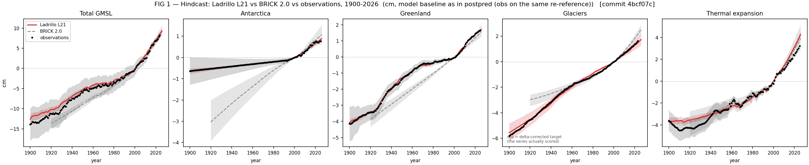
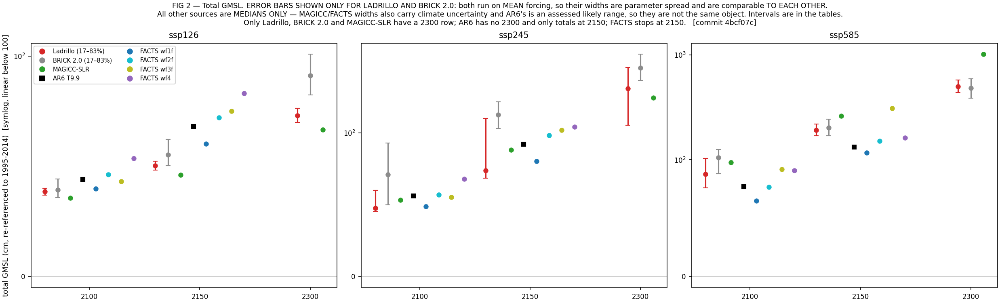

# Ladrillo (L21) — model description, evaluation, and open concerns
### DRAFT for Marcus. Technical content complete; argument and voice are yours.

> ⚠⚠ **VINTAGE DECISION PENDING (2026-09-02) — READ BEFORE QUOTING ANY §3 NUMBER.**
> This document is written on **L21**, which was champion when it was drafted (2026-08-28 to 09-01).
> **L23 is champion now**, and **L24** is the only vintage on the shipped prior N(1.09, 0.180).
> Which vintage the document should describe is Marcus's call and is not made here.
>
> **§1, §2 and §4 are essentially vintage-insensitive.** The hindcast table in §2 was re-verified
> 2026-09-02 and reproduces exactly; L24's differs only in the third decimal and its thermal-expansion
> row is identical (1.149 / 1.137 / 1.462 / 1.236).
>
> ⛔ **§3 IS NOT.** The projection medians move materially, and almost entirely at ssp245:
>
> | cell | L21 (as written) | L23 | L24 | L24/L21 |
> |---|---|---|---|---|
> | ssp126 2300 | 70.9 | 72.9 | 72.6 | 1.02x |
> | ssp245 2150 | 74.8 | 108.2 | 100.5 | **1.34x** |
> | **ssp245 2300** | **158.9** | **263.8** | **249.2** | **1.57x** |
> | ssp585 2300 | 491.6 | 519.2 | 481.6 | 0.98x |
>
> ⚠ **This also moves §3's "single clearest characterisation".** The ssp585/ssp245 separation falls
> from **3.09x (L21) to 1.93x (L24)**, so the claim that Ladrillo's scenario response is steeper than
> AR6's is materially weaker on the newer vintages and must be re-checked, not carried over.
>
> ⚠ **And L21-vs-L23/L24 is NOT like-for-like** — their amp priors differ (N(0.95, 0.10) vs
> N(1.09, 0.10) vs N(1.09, 0.180)). See **C12**. The difference is a prior change, not a model
> improvement, and must not be presented as one.

**Status.** Ladrillo posterior **L21** is the canonical arm (promoted 2026-08-28). L21 is L14's
*exact* configuration re-run on the **fair-calibrate 1.6.0 + CMIP7** drivers — no model or prior
changed. It replaced L14 for **coherence, not fit**: L14 is calibrated against driver files that no
longer exist in the tree, so re-running any L14 step now silently yields different numbers under
the L14 name.
Prior lineage: MimiBRICK v2.0.0 → Ladrillo. Basis for every projection number below:
**cm, re-referenced to 1995–2014**. Commit `bfc65ae`. Frozen comparison inputs are
hashed in `benchmark/reference/_fixed/manifest.json`.

> **[MARCUS — framing paragraph goes here.]** What Ladrillo is for, and why a standalone,
> global-only, calibrated SLR emulator is the right object for this use. The two positioning
> claims you named — *standalone* (vs MAGICC, which SLR rides inside) and *simpler, global-only*
> (vs FACTS) — belong here in your words.

---

## 1. What changed since BRICK 2.0, and why

Changes to the model and its calibration. Approaches that were tested and discarded are
recorded in `CHANGELOG.md`, not here.

### 1.0 How every reservoir is driven: regional, not global, temperature

Sea-level components do not respond to global mean temperature — they respond to the
temperature over the ice. Every reservoir in Ladrillo is therefore driven by a *regional*
temperature, built in two pieces:

* **Over the observed record**, the regional driver is an **observed** temperature series —
  for the glacier blocks, area-weighted HadCRUT5 over the glaciers actually in each block.
* **Beyond the observations**, the regional driver is extended as
  **amplification factor × global mean temperature**, anchored so the extension meets the
  observed level at the splice.

**The glacier amplification factor is a CONSTANT.** One number per block, not a function of
time and not a function of warming level: it is the slope of a straight-line fit of regional on
global temperature, so the projected regional temperature is **linear in global mean
temperature**. It is *not* re-estimated as the projection runs, and it does not drift.

The one thing it is not is a *fixed* number. **It is sampled** — each posterior draw carries its
own value from the prior below — so it is **constant within a draw and uncertain across draws**,
and that uncertainty propagates into the projection band. Antarctica's factor works the same way.
**Greenland is the exception**: it carries an `amp(GMST)` law, so its ratio does vary with
warming level.

Where the prior comes from differs by component, and this is worth stating plainly because it is
the main place the model imports outside information:

| component | amplification prior | source |
|---|---|---|
| **Glaciers** (3 blocks) | **One constant per block**, sampled: R19 0.72 ± 0.15, SLOWP 2.50 ± 0.45, FAST 1.45 ± 0.15 | **Observed temperature products.** Centred near HadCRUT5, σ from the spread *across* Berkeley Earth / HadCRUT5 / GISTEMP, hard bounds = the cross-dataset range (e.g. SLOWP: BE 1.82, HadCRUT 2.48, GISTEMP 3.46). |
| **Greenland** | **Not constant** — `gis_amp` sampled, with an `amp(GMST)` law | Zone-and-window keyed prior file; the law lets the ratio vary with warming rather than holding one number. |
| **Antarctica** | **One constant**, sampled: `ais_gmst_amp` ~ N(0.95, 0.10) | **CMIP6** (Xie et al. 2022, Sci Rep 12:16548), a polar-cap temperature ratio. |

> ⚠ **What holding the factor constant does and does not assume.** The glacier factors are a
> through-origin fit of regional on global temperature over **1901–2024**, and Antarctica's is one
> CMIP6-derived number. Carrying that constant forward assumes **the historical regional-to-global
> ratio continues to hold** — it is the assumption, not an incidental implementation detail.
>
> And the uncertainty attached to that assumption is **narrower than it may appear**: the σ on
> each glacier factor is the **disagreement between observational products about the historical
> slope** (SLOWP: Berkeley Earth 1.82, HadCRUT5 2.48, GISTEMP 3.46), *not* a measure of how much
> the ratio varied over history, and *not* an estimate of how much it might change in future.
> **So nothing in the glacier or Antarctic priors covers the possibility that the amplification
> itself shifts under strong warming** — sea-ice loss, circulation change, or a saturating
> polar response would all violate it, and the band would not widen.
>
> Two things bound this. **Greenland is the exception**: it carries an `amp(GMST)` law, so its
> ratio *does* vary with warming level, and its prior file holds "early"/"modern" window arms, so
> the temporal-stability question has at least been posed there. **For Antarctica the constant is
> evidence-based**: a warming-dependent law was tested against corrected CMIP6 data and is not
> supported (unresolved on both scenarios, with opposite signs). **For glaciers the test has now been run
> (2026-08-27) and the assumption survives.**
>
> **The glacier early/modern test.** Split on Greenland's own window convention (early
> 1901–1960, modern 1961–2024), the fit *appears* strongly non-stationary: R19 moves +0.42
> (z = +3.5) and SLOWP −1.24 (z = −4.4), both ~2.8 prior σ — **and in opposite directions,
> which is the tell.** Both are an artefact. The fit is through-origin, forcing both series
> through zero at 1850–1900, so a small constant offset in the early window — where global
> anomalies are weak (rms 0.24 K against 0.77 K) — is divided by a small denominator and
> appears as a slope change. Refitting with a **free intercept** collapses every block's
> window difference to **≤0.12, under 1 prior σ**. And the fit the model actually uses is
> already modern-weighted: leverage goes as GMST², so the 1901–2024 fit sits within
> **0.23σ** of a modern-only fit. ⇒ **No material non-stationarity, and the shipped factor
> is effectively the modern-era one — the right basis for a projection.** What no historical
> test can bound is a *future* change in the ratio.
>
> **Could CMIP6 inform the glacier factors instead?** It could, and it would move them.
> Against 43 CMIP6 models the observed amplification sits **below** CMIP6's for every block
> at **every one of five baseline frames** (obs ÷ CMIP6 = 0.71–0.99, range ≤0.28, never
> reversing) — unlike Greenland's offset, which *reverses sign* across frames and is
> therefore a frame artefact. Adopting CMIP6 would raise R19 by **+0.15** and SLOWP by
> **+0.36**, and widen the priors **1.2–1.6×**. That is the same fit-versus-provenance
> tension settled for the Antarctic amplification in favour of fit; for glaciers it is
> **not** settled, and it is a live choice rather than a defect.
>
> **Could observations anchor the level and CMIP6 supply the future *shape*?** Greenland already
> works this way — a projection-side amplification law anchored to an observed level — so the
> pattern exists. For glaciers it was tested (2026-08-28, `scope_glac_amp_law_form.py`, same
> method that settled the identical question for Antarctica: per-model secant regressed on ΔT,
> restricted to ΔT ≥ 1 K, 43 models):
>
> | block | CMIP6 slope /K | z | worth over 1–4 K | ÷ between-model sd | reading |
> |---|---|---|---|---|---|
> | **SLOWP** | −0.0003 | −0.01 | −0.001 | 0.00 | **flat — no shape to borrow** |
> | R19 | −0.0249 | −2.54 | −0.075 | 0.33 | resolved but small vs the spread |
> | **FAST** | +0.0288 | +3.02 | **+0.087** | 0.66 | **a real shape** |
>
> **Only FAST has a shape worth the name, and even there it is 0.58 prior σ across the entire
> 1–4 K range — inside the uncertainty already carried.** SLOWP, which dominates the glacier
> contribution, is dead flat (z = −0.01). And the term the hybrid would *not* fix is the larger
> one: the level offset between CMIP6 and observations is **3.4× the shape for R19 and 383× it
> for SLOWP.** So the hybrid buys a second-order refinement while leaving the first-order
> disagreement (C10) untouched. **Recommended: not worth building for glaciers** — the same
> conclusion, by the same test, that stopped `amp(ΔT)` being built for Antarctica.
> ⚠ FAST is the one place a future case could be made, and it is the block where a law would
> matter least: it is the smallest-amplification, fastest-equilibrating block.
>
> **What the forward splice actually is, since "linear" and "constant amplification" are the
> same choice.** Beyond the observations the driver is
> `T_reg(t) = amp_b × GMST(t) + offset`, with the offset fixed so the line meets the **observed
> 11-year mean at the splice point** (`extend_obs`, anchor-preserving). So the *level* is the
> observed one — observations are not overwritten by a model — and only the forward *increment*
> is modelled. That extrapolation is **linear in GMST, not in time**, and the amplification is
> **already held constant**: a constant amplification is exactly what makes the relation linear.
> The alternative is not "constant instead of linear" but `amp(ΔT)`, which would make the
> relation **curved**.
>
> **And CMIP6 supports the constant.** SLOWP — the dominant block — is flat (z = −0.01); R19's
> slope is resolved but a third of the between-model spread; only FAST argues for curvature. If
> CMIP6's slopes were exactly right, holding amplification constant to 4 K would bias regional
> temperature by **+0.30 K (R19), +0.00 K (SLOWP), −0.35 K (FAST)** — and **R19 and FAST point
> opposite ways, so they partly cancel in the glacier total.** That is the case for leaving the
> extrapolation as it is.

### 1.1 Glaciers — from one saturating reservoir to three regional ones

BRICK 2.0's glacier model was a **single reservoir that was either not melting or committed to
full melt**: the Wigley–Raper formulation saturates, so it cannot reproduce the observed
20th-century trajectory and the scenario spread at the same time.

| change | justification |
|---|---|
| Wigley–Raper → **Mengel-style equilibrium volume `S_eq` + Nauels-ν transient** on regional temperature (`extB3`) | Separates *how much* ice is committed at a given warming from *how fast* it gets there — the two things the single saturating reservoir conflated. |
| **Three reservoirs: SLOWP / FAST / R19** (`extC`) | See below — the third is not a third timescale. |
| **Sampled `gic_amp`** per block (§1.0) | The regional amplification was pinned at one number with no uncertainty, and it is a first-order control on the projection. |
| **Glacier inventory likelihood** + 19th-century flow constraint `S(1900) − S(1850) ~ N(0.020, 0.009)` m SLE | Anchors the absolute inventory and the pre-observational flow, neither of which the 20th-century transient identifies on its own. |

**Why three reservoirs and not two.** Two of the blocks are the expected pair of response
timescales, split by region:

* **SLOWP** = RGI regions 03, 09, 07, 06 (Arctic Canada North, Russian Arctic, Svalbard,
  Iceland) — large, high-latitude, long-τ, and strongly amplified (prior 2.50).
* **FAST** = the remaining 13 regions — smaller, faster-responding, weakly amplified (1.45).

**The third block, R19 (Antarctic and Subantarctic periphery), exists for an *observational
scope* reason, not a dynamical one.** The historical glacier target (Frederikse) **assumes zero
Antarctic-periphery melt**, while the GlaMBIE splice used from 2019 onward **includes it**. If
R19 were folded into either other block, the model's hindcast scope would no longer match the
scope of the series it is scored against. Keeping it separate lets the hindcast be evaluated on
`SLOWP + FAST` — exactly the target's scope — while R19 still contributes to projected totals.
Its amplification prior (0.72) is also far below the other two, so it is not physically
interchangeable with them either.

### 1.2 Greenland — one channel to a constrained multi-basin sheet

| change | justification |
|---|---|
| **Two-channel (fast/slow) module** wired into the joint calibrator | A single channel cannot carry outlet/dynamic response and surface-mass-balance response with different time constants. |
| **Channel ordering enforced** (`--gis-ordered`) | The fast channel must be faster than the slow one. Without the constraint the two are exchangeable and the posterior can invert them, which is not a physical solution. |
| **`gis_amp` sampled, with an `amp(GMST)` law** | It was pinned, and it is the dominant control on the 2100 Greenland projection. The law reduced the G4 spread 9.80 → 7.37 cm. |
| **Multi-basin sheet** with sector shares and a pinned reference basin | Greenland does not respond as one body. The reference basin is pinned because the common mode of the basin shares is *exactly* degenerate — pinning removes an unidentified direction rather than adding information. |
| **High-basin volume tap**: V = 5.64 m, τ = 800 yr, onset 4.69 K, whole-sheet, 2 stages | Represents post-2100 commitment above a threshold. Part of the shipped configuration and included in every projection, but it does not fire on scenarios that stay below the onset: exactly zero at SSP1-2.6 and SSP2-4.5, 41.8 cm on the SSP5-8.5 total at 2300. |

### 1.3 Antarctica — freed geometry, and an identified runoff line

| change | justification |
|---|---|
| **7 DAIS geometry parameters freed** under a joint paleo prior (standardised correlation form, cond 2.75 vs 5.2e13 raw) | **This is the change that fixed the pre-1990 Antarctic melt.** See below. |
| **Runoff line sampled in its identified direction**: `T_on = −h0/c` instead of (h0, c) | h0 and c enter the model only as `hR = h0 + c·T_ant`, so individually they ride an r = 0.9997 ridge that no sampler can traverse. `T_on` — the runoff onset temperature — is the combination the data actually constrain. |
| **`amp` freed** with prior N(0.95, 0.10) (§1.0) | Stock DAIS hard-codes 1.196, the inverted paleo *equilibrium* regression, applied to a *transient* problem. |
| **SMB likelihood term** on β_total vs Rignot 2019, area-corrected ×0.888 | The posterior pinned SMB − discharge to −145 ± 15 Gt/yr while each flux individually sat at ±505/±509 — the classic input–output degeneracy. One term anchors the absolute flux scale. |

**Freeing the DAIS geometry is what removed the excess pre-1990 Antarctic melt.** With the
geometry fixed at the prior medoid, BRICK 2.0 draws far more early-20th-century Antarctic mass
loss than the record supports; Ladrillo tracks the observations to within a hundredth of a
centimetre over the same period:

| year | observed | Ladrillo error | BRICK 2.0 error |
|---|---|---|---|
| 1925 | −0.498 cm | **−0.009** | **−2.314** |
| 1950 | −0.363 | +0.002 | −1.395 |
| 1975 | −0.227 | +0.001 | −0.556 |
| 1990 | −0.146 | +0.010 | −0.135 |
| 2005 | +0.100 | +0.042 | +0.063 |

The two models converge by the satellite era — the disagreement is entirely pre-1990, and it is
a ~2.3 cm overstatement of cumulative Antarctic contribution at 1925. This is the same thing the
hindcast RMSE ratios in §2 report as 0.003 (1920–1949) and 0.008 (1950–1992) against 0.548 in
1993–2026.

### 1.4 Calibration targets and forcing

| change | justification |
|---|---|
| **Dangendorf 2024** GMSL, with the total's σ inflated by Frederikse's own budget-closure spread | The closure error is measured, so it is used rather than assumed. |
| **LWS extended with JPL GRACE/GRACE-FO mascons**; closure σ trend-extended | Both were held flat over 2019–2026; the extension replaces held-flat values with data. |
| **Component-level fitting** with a mean-zero discrepancy basis on glaciers and steric, orthogonal to the signal | Prevents the total from double-counting its own components; the basis is orthogonal to S(t), not merely to a constant. |
| **Mean FaIR 2.2.4 (calib 1.6.0, CMIP7 history to 2023) forcing** per SSP, FaIR-consistent conditional weighting | Fixes the climate driver so the posterior spread is parameter uncertainty — which is *why* the bands in §3 are not comparable to MAGICC's or FACTS'. |
| **Over-dispersed chain starts** | Every earlier run started all four chains at the same point, which makes R̂ anti-conservative: between-chain variance cannot reflect posterior mass no chain ever reached. |

## 2. Hindcast: Ladrillo L21 vs BRICK 2.0 vs observations

**FIG 1.** Posterior median and 5–95% band, 1900–2026, against the calibration targets.
*Glaciers are shown against the **delta-corrected** target — the series the model is actually
scored on (`posterior_predictive_ladrillo.jl:206`); the raw `gsic` column is a different object
and plotting it would show a ~1.8 cm bias at 1900 that does not exist.*

**RMSE ratio, L21 ÷ BRICK 2.0 (< 1 = Ladrillo better):**

| component | 1920–1949 | 1950–1992 | 1993–2026 | full |
|---|---|---|---|---|
| Antarctica | **0.004** | **0.010** | 0.550 | **0.026** |
| Greenland | **0.101** | **0.054** | 0.271 | **0.081** |
| Glaciers | 0.366 | 1.030 | 0.354 | 0.376 |
| Thermal expansion | 1.149 | 1.137 | 1.462 | **1.236** |
| **Total** | **0.412** | **0.278** | 1.137 | **0.374** |

Reading: the ice-sheet components are where the rebuild bought almost everything (Antarctica ~38×,
Greenland ~12× on full-window RMSE), and both are essentially unchanged by the calib-1.6.0
migration. Glaciers gain ~2.7× overall but are **level with BRICK 2.0 in 1950–1992 (1.030)**.

> ⚠ **Thermal expansion is now WORSE than BRICK 2.0 (1.236), and this reversed at the migration.**
> Under the previous calib-1.4.5 posterior TE was 0.988 — indistinguishable from BRICK 2.0. The
> 1.6.0 drivers improved the OHC input sharply (RMSE vs Zanna/IGCC 6.80 → 3.83, a 44% gain) but
> the gain is **early-record**, and TE is driven by OHC alone. So TE is now **better early and
> worse modern**: bias at 1900 −0.468 → **−0.116 cm**, at 2025 +0.592 → **+0.847 cm**. Full-window
> RMSE goes 0.320 → 0.401 cm — read the ratio against that small base, but do not present TE as
> merely "not rebuilt" any more. It is the one component the migration made worse, and it is worse
> than the model being replaced.
>
> ⚠ **These are BARE-MODULE biases, and that is the right basis for this comparison** — BRICK 2.0 has no discrepancy term, so raw-vs-raw is the like-for-like one. But do not carry them across into statements about how badly the *fit* misses: `posterior_predictive_ladrillo.jl` applies no `d2`, and the residual the likelihood actually scores at 2025 is **+0.227 cm = 4.52σ**, not +0.889 cm = 17.79σ. See **C7**.

In the satellite era the total is now **1.137** (was 0.965), i.e. slightly worse than BRICK 2.0
where the data are strongest, while 1950–1992 improved to **0.278**. The full-window total is
essentially unchanged at 0.374.

> **[MARCUS — one paragraph on what the hindcast gain does and does not license.]**

---

## 3. Projections, like-for-like

**FIG 2.** Total GMSL, all sources on one basis. **Error bars are drawn for Ladrillo and
BRICK 2.0 only.** Both run on mean forcing, so both widths are posterior-parameter spread and
are comparable *to each other*; every other source's width is a different object (MAGICC and
FACTS carry climate uncertainty as well, AR6's is an assessed *likely* range), so those are
shown as **medians only** rather than inviting a comparison the caveat below forbids. Their
intervals are in `outputs/doc_tables_L21.md`, where each column's bracket is labelled with
what it actually is. Ladrillo, BRICK 2.0 and MAGICC-SLR are ordered first because they are
the only three with a 2300 row. Full component tables in the same file.

> ⚠ **Band caveat, and it is the important one.** Ladrillo and BRICK 2.0 run on **mean climate
> forcing**, so their bands are **posterior-parameter spread only**. MAGICC and FACTS bands
> **also carry climate uncertainty**. **Medians are comparable; band widths are not.**

> ⚠ **Coverage is not uniform. Blanks mean *no data*, not zero.** FACTS stops at **2150**.
> **AR6 Table 9.9 has no 2300 row and only totals at 2150.** MAGICC-SLR and BRICK 2.0 run to
> **2300**.

> **AR6 T9.9** = IPCC AR6 WG1 Ch9 Table 9.9 (Fox-Kemper 2021, p.1302), median and *likely*
> (17–83%) range, medium confidence, verified from the chapter PDF. This is the **assessed IPCC
> number itself**, not a FACTS workflow standing in for one.

> **FACTS workflows, identified from the data** (not from the AR6 taxonomy — each 3/3 on three
> statistics): `wf1f` = ar5AIS + FittedISMIP; `wf2f` = larmip + FittedISMIP (**no MICI, no expert
> elicitation** — the pure process workflow); `wf3f` = deconto21/**MICI** + FittedISMIP; `wf4` =
> **bamber19 in both ice sheets = the structured-expert-judgement envelope**.

### Total GMSL — median [17–83%]

| scenario | horizon | Ladrillo L21 | AR6 T9.9 | FACTS wf1f | FACTS wf2f | FACTS wf3f (MICI) | FACTS wf4 (SEJ) | MAGICC-SLR | BRICK 2.0 |
|---|---|---|---|---|---|---|---|---|---|
| ssp126 | 2100 | 37.8 [32.7, 45.3] | 44.0 [32, 62] | 39.8 [31.1, 48.5] | 46.1 [37.0, 61.3] | 43.1 [37.0, 50.0] | 53.5 [35.5, 83.9] | 35.6 [27.4, 48.9] | 41.5 [35.1, 71.0] |
| ssp126 | 2150 | 49.2 [41.8, 60.6] | 68.0 [46, 99] | 60.2 [43.5, 77.6] | 72.0 [55.1, 97.5] | 74.9 [60.4, 96.6] | 83.1 [52.5, 144.2] | 45.9 [34.0, 66.9] | 58.2 [48.9, 116.9] |
| ssp126 | 2300 | 70.9 [58.0, 92.3] | — | — | — | — | — | 66.5 [47.0, 106.5] | 94.8 [78.7, 229.1] |
| ssp245 | 2100 | 47.3 [40.2, 73.4] | 56.0 [44, 76] | 48.7 [39.0, 58.1] | 56.9 [46.0, 75.2] | 55.1 [46.8, 81.2] | 67.9 [45.2, 120.2] | 53.2 [40.6, 70.4] | 67.1 [43.0, 96.3] |
| ssp245 | 2150 | 74.8 [58.5, 147.6] | 92.0 [66, 133] | 80.0 [61.9, 99.3] | 98.1 [79.9, 134.6] | 105.2 [83.1, 300.4] | 111.2 [71.9, 207.7] | 88.1 [64.6, 125.3] | 133.9 [69.2, 177.9] |
| ssp245 | 2300 | 158.9 [91.9, 347.7] | — | — | — | — | — | 186.8 [118.0, 305.9] | 302.7 [130.8, 406.8] |
| ssp585 | 2100 | 86.3 [62.9, 110.8] | 77.0 [63, 101] | 64.9 [54.4, 77.2] | 76.6 [63.6, 101.8] | 91.9 [70.6, 114.9] | 90.8 [60.7, 160.2] | 97.8 [74.8, 132.3] | 97.0 [75.7, 122.0] |
| ssp585 | 2150 | 190.6 [150.5, 234.5] | 132.0 [98, 188] | 117.1 [96.7, 141.5] | 151.7 [123.6, 208.4] | 310.7 [193.8, 476.6] | 162.3 [113.3, 306.4] | 262.9 [189.7, 387.8] | 194.0 [153.7, 242.8] |
| ssp585 | 2300 | 495.3 [389.0, 613.5] | — | — | — | — | — | 1016.0 [691.1, 1585.3] | 463.6 [356.4, 611.0] |

> **BAND BASIS (2026-08-30).** Ladrillo is reported on the **JOINT** arm — posterior parameters
> × 841 FaIR configs — at **all 54 of 54 cells**. This is the only Ladrillo band that is
> like-for-like against MAGICC and FACTS, both of which carry climate uncertainty, and it is the
> first version of this table in which the widths may be compared at all.
> The Greenland tap is now applied **per config on that config's own GMST path**
> (`scope_slr_fair_uncertainty.jl --tap`, added 2026-08-30), so a config that never reaches the
> 4.69 K onset never fires it. That threshold crossing is real physics the mean driver could not
> represent, and it is visible: **`gis` at ssp585/2300 widens from 15.1 cm (fixed) to 64.1 cm**.
> Every row's basis is in the `band_basis` column of `outputs/ladrillo_model_comparison_L21.csv`.
> ⚠ **BRICK 2.0 IS NOW ON ITS OWN JOINT ARM TOO (2026-08-30) — every column in this table is
> like-for-like on WIDTH for the first time.** `scope_slr_fairunc_oldbrick.jl` propagates BRICK
> 2.0's published posterior across the same 841 FaIR configs, using the **same raw cubes, the same
> 2014 splice pivot, the same 1995–2014 re-reference and the same pairing seed** as the Ladrillo
> joint arm — deliberately, since divergent conventions would make the two bands incomparable and
> defeat the exercise. All 54 reported cells are on the joint arm; its `[CONTROL]` (fixed arm vs
> the shipped panel, on the shipped panel's **own thinning**) passes 18/18 per SSP, and
> `[SPLICE-MATCH]` reproduces the committed python cube to **4.985e-07 °C**.
> ⚠ **This is a PRIOR PROPAGATION, NOT A REFIT** — BRICK 2.0's posterior was calibrated under its
> own fixed forcing. Same caveat the Ladrillo joint arm carries.
> ⚠ **`[SPLICE-MATCH]` can only run on ssp585**, the one SSP with a committed python-spliced cube.
> ssp126/ssp245 use the identical code path, so the convention is verified once and applied
> uniformly — but is not independently checked there.
> *(An earlier draft said BRICK 2.0 "can never be made joint". `set_forcing!` takes an arbitrary
> (gmst, ohc) pair; that claim was wrong and is withdrawn.)*
>
> ⚠ **BRICK 2.0 was regenerated on calib 1.6.0 on 2026-08-30.** Until then its projection was built
> on **calib 1.4.5** mean forcing while every Ladrillo number was on 1.6.0 — a forcing-trajectory
> mismatch worth up to **0.55 K** (−0.380 K at 2100). The 1.4.5 output is quarantined under
> `outputs/quarantine/20260830_oldbrick_calib145_forcing/`; the glacier arm
> (`ssps_gsic_2300.csv`) was regenerated the same day and `[GSIC-MATCH]` now closes at 0.0000 cm
> over 192 rows compared.

### Total GMSL — 17–83% WIDTH, cm. All four sources now carry climate uncertainty

| cell | Ladrillo | BRICK 2.0 | MAGICC-SLR | FACTS wf1f |
|---|---|---|---|---|
| ssp126 2100 | **12.6** | 35.8 | 21.5 | 17.4 |
| ssp126 2150 | **18.8** | 68.0 | 32.8 | 34.1 |
| ssp126 2300 | **34.3** | 150.4 | 59.5 | — |
| ssp245 2100 | 33.1 | 53.4 | 29.8 | **19.1** |
| ssp245 2150 | 89.1 | 108.7 | 60.7 | **37.4** |
| ssp245 2300 | 255.9 | 276.1 | **187.9** | — |
| ssp585 2100 | 47.8 | 46.3 | 57.5 | **22.8** |
| ssp585 2150 | 84.0 | 89.1 | 198.1 | **44.8** |
| ssp585 2300 | **224.5** | 254.5 | 894.3 | — |

> **The reading, now that this comparison is legitimate.** Ladrillo is **narrower than BRICK 2.0 at
> eight of nine cells**, and the gap is worst exactly where the benchmark already flags it: at
> **ssp126** Ladrillo is **2.8× narrower at 2100 and 4.4× narrower at 2300**. That is independent
> confirmation of the standing cool-scenario under-dispersion finding, now against a like-for-like
> comparator rather than against a fixed-driver one. At ssp585 the two are within ~13% at every
> horizon. MAGICC is the outlier at high forcing (894 cm at ssp585/2300, ~4× ours).
> ⚠ Part of Ladrillo's ssp585/2300 width is a **prior**, not an inference (78% of the AIS band is
> `antarctic_lambda`), so narrowness is never scored as a win there.

### The single clearest characterisation: Ladrillo's scenario response is steeper than AR6's

**Ladrillo ÷ AR6 Table 9.9 median** (L14 → L21, i.e. before → after the migration):

| horizon | ssp126 | ssp245 | ssp585 | ssp585 ÷ ssp126 |
|---|---|---|---|---|
| 2100 | 0.80 → **0.87** | 0.80 → **0.85** | 1.23 → **1.14** | 1.54 → **1.31×** |
| 2150 | 0.67 → **0.74** | 0.77 → **0.80** | 1.52 → **1.46** | 2.26 → **1.98×** |

The ssp585 − ssp126 median spread:

| horizon | AR6 | Ladrillo L14 | Ladrillo L21 |
|---|---|---|---|
| 2100 | 33.0 cm | 59.6 (1.81×) | **48.5 (1.47×)** |
| 2150 | 64.0 cm | 155.3 (2.43×) | **142.6 (2.23×)** |

**Ladrillo is still below the IPCC assessment at low forcing and above it at high forcing, and the
effect still grows with horizon — but the migration moderated it**, from 1.81× to 1.47× at 2100.
(Recomputed 2026-08-29 on the JOINT arm; was 1.49× on the fixed arm. The ratio is a MEDIAN ratio,
so it barely moves with the band basis — see §4.3.)
That is the harmonization, not the calibration: anchoring SSP5-8.5 to observed 2023 emissions
scaled its future by ×0.899 (it overshoots observed fossil CO2 by ~11%), while SSP1-2.6 undershoots
and was scaled ×1.075. So the two ends moved toward each other.

**At 2300, where AR6 and FACTS are both silent**, the only three sources are Ladrillo (502.0),
**BRICK 2.0 (482.4 — within 4%)** and **MAGICC-SLR (1016.0 — 2.0× Ladrillo)**. The two
BRICK-lineage models agree closely and MAGICC is the outlier; that agreement is *not* independent
evidence, since they share the DAIS/Greenland/glacier structural lineage.

A corroboration worth keeping: under the migrated drivers the 2010–2019 GMST bias against IGCC is
**identical across all three SSPs at −0.026 K**, where the previous drivers gave three different
values because each scenario carried its own RCMIP historical. One observed history, one historical
fit.

> **[MARCUS — interpretation of the ssp585@2300 factor-of-2 against MAGICC.]**

---

## 4. Largest remaining concerns

### 4.1 Ladrillo / L21

| # | concern | status | severity |
|---|---|---|---|
| **C1** | **The 3.6× is a RATIO OF TWO ANOMALIES and does not survive contact with the sampled coordinate.** Measured 2026-08-29 (`python/diag_ton_paleo_consistency.py`). The sampler does not work in GMST — the runoff line enters only as `hR = h0 + c·T_ant`, so the coordinate is `T_on = −h0/c` and **the paleo prior is rebuilt in exactly those coordinates** (`outputs/paleo_geo_prior_ton.csv`, from the DAISfastdyn ensemble): **T_on ~ −15.636 ± 5.539**. L21's posterior sits at **−17.861**, i.e. **0.40 prior sd from the paleo mean** (L14: 0.40) — **CONSISTENT**, not a conflict. The inflation comes from the **origin**: GMST here is an anomaly, so its zero is the 1850–1900 baseline convention, and the denominator (0.60 °C) sits near that zero. ⚠ **amp is NOT the lever — it cancels in the ratio.** Shifting only what counts as zero warming moves the ratio **2.41× → 31.5×** over a sub-degree range while the z-score stays fixed at −0.402. **What survives and should be disclosed:** onset is **+2.36 °C GMST earlier** than the paleo central (a difference is origin-invariant; state the baseline and the amp with it). ⚠ **The separate and REAL problem is the precision, not the location**: posterior sd ÷ prior sd = **0.0156**, a 64× tightening — and per C3 the chains never cross `T_on` modes, so that ±0.077 is a **within-mode** width, not a posterior width. | **LARGELY DISSOLVED 2026-08-29 — the ratio is WITHDRAWN; a bounded difference and a fake precision remain** | **Low–moderate**, downgraded from Highest. It should **no longer lead the caveats.** Report the z-score (0.40 σ) and the +2.36 °C difference; never the 3.6×. What still needs a sentence is that the reported `T_on` precision is within-mode. ⚠ Limitation: this is the MARGINAL z — the paleo prior is a joint MvNormal over 7 geo params and the full Mahalanobis distance was not computed. |
| **C2** | `ais_gmst_amp` is **unidentified** — posterior sd ÷ truncated-prior sd = 0.992; the posterior *is* the prior. It is degenerate with `T_on` at r = 0.79, so choosing the amp prior *is* choosing the runoff-onset decomposition. | **DECIDED, not resolved** | High, but bounded: the decision was made on fit, and the frame ambiguity (0.92–1.16 across masks/metrics, a span 1.3× one frame's between-model sd) means 0.95 is a *frame choice*, not an error. |
| **C3** | The **`T_on` posterior mode is start-determined.** Chains never cross bands: 4 chains started in LOW/LOW/HIGH/MID stayed 100% in their start band over 4M draws. The barrier is real — all 16 chains sit 3.5–28.5× above a driftless-diffusion null of 2.0×. | **Mitigated, not eliminated** | Moderate. MID independently wins the equilibrated log-density by 5.7–6.9 nats (~40–140× after a volume correction), so the champion's mode is the right one — but it was verified *by a separate arm*, not by L14's own run. |
| **C4** | **20 parameter marginals are not converged**, accepted under the documented `--accept-slr` deliverable gate. Projected SLR *is* converged across chains (R̂ < 1.05 at all horizons). | Disclosed gate | Moderate — must be stated in any write-up. |
| **C5** | **CLOSED 2026-08-30. Every source in the comparison is now on a band that carries climate uncertainty.** Ladrillo is on the JOINT arm at 54/54 cells (`--tap` added to the joint driver so the tapped Greenland has a joint band at all), and **BRICK 2.0 is now on its own joint arm at 54/54** (`scope_slr_fairunc_oldbrick.jl`, same cubes / splice pivot / re-reference / pairing seed). Measured cost of the old fixed-band choice: **1.2–5.3× at p17–p83 for Ladrillo** and **1.27–6.23× for BRICK 2.0**, both worst at ssp126 — the fixed band understated *both* models most exactly where they were being called narrow. Every row carries a `band_basis` column. ⚠ Two caveats travel with the fix: both joint arms are **prior propagations, not refits**, and `[SPLICE-MATCH]` can only be run on ssp585. | **CLOSED** | **Low.** ⚠ It changed a substantive reading rather than just a caveat: with widths finally comparable, **Ladrillo is narrower than BRICK 2.0 at 8 of 9 cells, by 2.8–4.4× at ssp126** — independent confirmation of the cool-scenario under-dispersion the benchmark already flags. |
| **C6** | At a **1.09 amp centre** the ssp126 AIS band widens **6.5×** and is **not** bimodal tipping (<3% of draws tip at ssp126 in any arm) — mechanism unexplained. | OPEN | Low *for the shipped model*: at the adopted 0.95 centre the band is the narrow 6.91 cm. Flagged because it is unexplained, not because it is active. |
| **C8** | **Scenario response is steeper than AR6's** — Ladrillo ÷ AR6 median 0.87/0.85/1.14 at 2100 and 0.74/0.80/1.46 at 2150. The ssp585−ssp126 spread is **1.47× AR6's at 2100** (2.21× at 2150); the migration moderated this from 1.81×/2.43× via the CMIP7 harmonization. ⚠ **But against the process models actually in this comparison, Ladrillo is MID-PACK, not steep** (measured 2026-08-29, total median ssp585−ssp126): 2100 — FACTS **25.2** < **Ladrillo 48.5** < BRICK 2.0 **56.8** < MAGICC **62.3** cm; 2150 — FACTS 56.9 < **BRICK 2.0 137.3** < **Ladrillo 141.3** < MAGICC **217.0** cm. Ladrillo is *below* MAGICC and BRICK 2.0 at both horizons. The steepness is relative to **AR6 and FACTS**, not to process models generally. | **ACCEPTED 2026-08-29 (Marcus) — disclose, do not chase** | **Low–moderate**, downgraded from High. MAGICC's spread is larger than ours at both horizons, so this is a position within a spread of comparators, not an outlier. State the AR6 ratio and the comparator ordering together; quoting the AR6 ratio alone overstates it. |
| **C11** | **The Coulon comparison arms were re-specified on the temperature INTEGRAL** (2026-08-28) after the endpoint was shown insufficient: AIS@2300 is linear in the integral at **18.8 / 18.1 cm per °C-century** on two vintages with disjoint config sets, and endpoint selection was silently admitting **~105 cm (tant12) / ~62 cm (tant14)** of AIS ambiguity. The `+17.0 °C` arm now has **zero** supporting configs and is omitted, not substituted. Width vs Coulon: tant12 0.71→**0.65×**, tant14 1.01→**0.96×**. ⚠ Those moves confound **two** changes (L14→L21 *and* the selector) and are not attributable without an integral-centred L14 run. **The match to Coulon's own integral is now DELIVERED** (2026-08-29): their four GCMs' post-2100 series were built on both averaging domains, and the build reproduces the published endpoint table to **±0.00 K** on all four models and both domains from an independent path. ⚠ **The paper never states its averaging domain** (verified against the PMC full text), so the comparison is reported as a **BOUND, never a single number** — 2015–2299 integral, °C-century: **land proxy 23.59–32.89, all cells 23.10–29.51**, against our ensemble max 27.25 and 25.72 reachable at the median amp. Reachable **1 of 4 (land) / 2 of 4 (all cells)** — the *same* split as the endpoint, so the domain-sensitivity finding is robust to the statistic. ⚠ But **which** model flips differs: UKESM flips on the endpoint and not the integral (amp 0.951, 47.4th percentile, 0 configs — it just misses); IPSL flips on the integral. MRI is reachable throughout, CESM2-WACCM never. See `deliverables/coulon_comparison_bound.md`. | **RESOLVED as a bound** | Moderate. ⚠ The width moves (0.71→0.65×, 1.01→0.96×) confound L14→L21 with the selector re-spec and are **not** separately attributable. **Marcus 2026-08-29: that is accepted and will not be chased** — intermediate vintages need no forensic accounting, only L21's differences from **BRICK 2.0** need defensible reasons. Quote the bound and the reachability split, never the width-move deltas as if they were attributable. |
| **C9** | **Amplification factors are assumed stationary** for glaciers and Antarctica. **Tested for glaciers (2026-08-27); the assumption holds** — on an early/modern split, window differences fall to ≤0.12 (<1 prior σ) once a free intercept is allowed, and the shipped 1901–2024 fit is within 0.23σ of a modern-only fit. Not covered: a *future* change in the ratio. | **TESTED — holds** | Low–moderate (downgraded). |
| **C10** | **CMIP6 puts glacier amplification above the observations at every baseline frame** (obs ÷ CMIP6 = 0.71–0.99 across five frames, never reversing — so unlike Greenland's, it is not a frame artefact). Adopting it would raise R19 +0.15, SLOWP +0.36, and widen the priors 1.2–1.6×. Same fit-vs-provenance tension settled for the Antarctic amp; unsettled here. | **OPEN — a choice, not a defect** | Moderate. |
| **C7** | **Thermal expansion is the one component the migration made worse, and worse than the model it replaces** (benchmark ratio **1.236** vs BRICK 2.0's 0.988; identical in L21, L23 and L24). ⭐ **RESOLVED IN CAUSE 2026-09-02: it is a FaIR OHC problem end to end, and the sea-level model's expansion coefficient is CORRECT.** Five results close it. **(i) Half the apparent miss was DEPTH SCOPE, and the benchmark was not applying it** — FaIR's OHC is full-depth, the steric target is built from 0-2000 m products (the target file's own header says so). Correcting on IGCC's own >2000 m layer takes the rate ratio 1.27x → **1.15x** and z **+5.87 → +3.64**; now wired into `bench_ladrillo.py` as a bounded, three-valued cell (the heat-ratio factor OVERSTATES a steric correction, because deep water expands less per joule) and deliberately NOT applied to acceleration, since IGCC's deep layer is a prescribed constant and carries no curvature. **(ii) What remains is the DRIVER, not the coefficient**: `TE = alpha x OHC` decomposes exactly as 1.270 = **1.236 (driver)** x 1.028 (alpha). **(iii) The miss is SHARED with BRICK 2.0** (1.17x, z=+3.74) on the same driver and a completely independent posterior, and **both models match the observed TOTAL rate** (1.07x / 1.04x) — so it is component attribution, not a sea-level error. **(iv) The degradation since L14 is a DRIVER FIX propagating**: calib 1.6.0 correctly halved a 2x early-century OHC bias (1900-50: observed 7.34, old driver 14.50, new 9.09), the fit's single alpha rose 6.4% (0.10571 → 0.11252) to keep hitting steric over 1900-2025, and that alpha — applied to a modern OHC still ~22% fast — **stopped offsetting it**. **(v) THE COEFFICIENT IS RIGHT AND A DEPTH SPLIT CANNOT HELP.** Against the OBSERVED OHC a single constant alpha ~0.11 reproduces the steric target across 1900-1950 / 1950-1993 / 1993-2024 to within **3%** (0.1082 / 0.1165 / 0.1130), and the fit's 0.11252 sits inside that range. The 41% epoch conflict exists ONLY under FaIR's OHC. A depth split is refuted in every form: box-wise, 5 of 6 configurations need a NEGATIVE coefficient; and for ANY re-mapping, 1950-1993 sits deeper than 1993-2025 at every cut, so any non-increasing alpha(depth) gives the wrong SIGN. Temperature-dependence fails the same way. | **CAUSE RESOLVED; the defect is EXTERNAL and OPEN in FaIR** | **Unchanged for the sea-level model, and no longer actionable inside it.** ⚠ The residual after depth scope is still a FAIL (~1.15x, z=+3.64), so this must be disclosed — but not as a Ladrillo defect. ⚠ Weakest link: Cheng and IGCC disagree **~50%** on 1950-1993 OHC gain, and under Cheng an epoch conflict survives.
| **C12** | **Three run-configuration flags were dropped on the L23 line, and one of them produced a headline result that had to be retracted.** L23/L23b/L24/L25 had no run script, so absent flags silently took defaults: `--gis-ordered --gis-basins2` (caught, quarantined `20260831_l23_missing_gis_flags`), `--adcov` (L23 onward inherited an older L11-era tuning covariance), and **`--amp-mu`** — L21/L22 pass `--amp-mu=0.95`, L23 onward took the default **1.09**. That last one is the whole of the "the glacier law moved Antarctica by +66 cm" result: the prior mean moved **+0.1400** and the posterior followed it **+0.1386** (ratio 0.990) on a parameter measured to be prior-dominated. ⚠ **A flag that is absent does not error; it selects a default, and the default is not the predecessor's value.** ⚠⚠ **L23 and L24 have the SAME original command line and different priors**, because `AMP_SIGMA`'s default moved between their run times. Mitigations shipped 2026-09-01/02: run scripts for every vintage with all axes PINNED and an arm-verification block; the calibrator now prints whether the proposal covariance was CHOSEN or INHERITED; and `champions.json` carries the original promotion reasoning verbatim beside a correction and a resolution. | **Mitigated; the affected claim is RETRACTED** | **Process, high.** No result is wrong now, but L23's promotion reasoning is void and **L23-vs-L21 is not like-for-like** — their amp priors differ. Any between-vintage delta must diff the run banners first. |

### 4.3 Band provenance — which band each source can reliably produce

Every width statement in this document depends on this table. Measured 2026-08-29 from
`outputs/scope_slr_fairunc_draws_ssp*_spliced_L21.csv` and `ladrillo_model_comparison.py`.

| source | what the band contains | horizons | components | availability |
|---|---|---|---|---|
| **Ladrillo — FIXED** | posterior parameters only (FaIR-**mean** driver) | 2100 / 2150 / 2300 | all 6 | **what §3–§4 report today** |
| **Ladrillo — JOINT** | posterior parameters **+ FaIR forcing** (841 configs) | 2100 / 2150 / 2300 | all 6 | **built for L21**; published p05–p95, p17–p83 recomputable from the draws |
| **BRICK 2.0** | posterior parameters only (mean forcing) | 2100–2300 | all 6 | **fixed only.** A joint band would require re-running BRICK under the 841 configs — not available |
| **MAGICC-SLR** | parameters **+ climate** (600-member AR6 drawnset) | 2100 / 2150 / 2300 | all 6 | available (⚠ the builder's docstring still says "ends at 2100"; it runs to 2305) |
| **FACTS** | parameters **+ climate** | **2100 / 2150 only** (2100 only for the `emu*` modules) | per module | available; **no 2300** |

**The rules that follow, and they are not negotiable:**

1. **A width comparison is defensible only between Ladrillo-JOINT, MAGICC and FACTS** — and only
   at 2100/2150, because FACTS stops at 2150.
2. **BRICK 2.0 can never enter a width comparison.** It is structurally fixed-driver. It remains a
   *hindcast* and *median* comparator, which is what the benchmark already uses it for.
3. **Medians are comparable across all four — except `ssp245@2300`**, where the fixed-driver median
   is a threshold artifact and must be quoted from the JOINT arm.
4. **Part of Ladrillo's own width is a PRIOR, not an inference** — 78% of the ssp585 2300 AIS band
   is `antarctic_lambda`'s paleo prior — so narrowness is never scored as a win there, on either arm.

**How much the current choice costs, total SLR, JOINT ÷ FIXED width:**

| ssp | 2100 (p17–p83) | 2150 | 2300 | 2300 (p05–p95) |
|---|---|---|---|---|
| ssp126 | 4.03× | 4.64× | 5.34× | **15.86×** |
| ssp245 | 2.26× | 1.45× | 1.23× | 1.26× |
| ssp585 | 1.76× | 1.64× | 1.47× | 1.57× |

> **CLOSED 2026-08-30.** The Ladrillo rows are on the JOINT arm at **all 54 of 54 cells**,
> BRICK 2.0 stays FIXED (it has no joint arm and cannot be given one), and the blanket disclaimer
> is replaced by a per-row `band_basis` column. §4.2 is a like-for-like width comparison.
>
> **How it got there, and the two things that nearly went wrong.**
> 1. **The joint draws were the wrong ARM, not missing.** `scope_slr_fair_uncertainty.jl` had no
>    tap support, so it projected the untapped Greenland. A blind repoint would have silently
>    dropped 41.3 cm of GIS at ssp585/2300. `--tap` was added (opt-in; the output tag carries the
>    arm so a tapped run cannot overwrite an untapped one) and the band re-run on all three SSPs.
> 2. **The first gate had no power.** It accepted a cell when the joint driver's fixed arm matched
>    this table to within the median's sampling error — which is satisfied at `total`/ssp585/2150,
>    where a real 1.31 cm tap offset is smaller than the total's own Monte-Carlo noise
>    (`no_power_null`). The shipped gate differences the two shipped files directly: exact, no
>    noise floor, no invented tolerance. It was **mutation-tested** — disabling it lets all 54
>    cells through — and it now correctly holds **none**, because the joint arm IS the tapped arm.
>
> **Validation:** the fixed arm reproduces the tapped shipped panel at **+0.0000 cm on all 54
> control cells**, `gis` ssp585/2300 included (88.722 vs 88.722). ⚠ That gate compares each arm
> against its *own* shipped panel, so passing at zero is expected and does not by itself prove the
> tap fired; what proves it is **which** panel was matched — the tapped one. An unfired tap would
> have produced ~47.4 cm there and a −41 cm CHECK.
> **Runtime:** ~3.5 min per SSP, ~11 min total, BLAS pinned.

### 4.2 The comparison models — and what we can honestly say

> ⚠ **Asymmetry of evidence, stated up front.** L21's concerns above are itemised because *we
> built it and instrumented it*. FACTS and MAGICC have not been audited to remotely the same
> depth here; what follows is what is visible **from their published structure and from their
> outputs in this comparison**, and it should not be read as a like-for-like concern audit.

| model | concerns visible from here |
|---|---|
| **BRICK 2.0** | Hindcast is **substantially worse on both ice sheets** (AIS 38×, GIS 12× on full-window RMSE) and the Antarctic trajectory is qualitatively wrong pre-2000 (FIG 1). Its glacier module (Wigley–Raper) saturates. In this comparison it survives only as the **glacier-only** legacy arm. |
| **FACTS** | **Not one number** — seven AR6 workflows. At ssp126/2100 the three process workflows alone span 39.8 (wf1f) – 46.1 (wf2f) cm, and `wf3f` carries **MICI** (deconto21), which at ssp585/2150 gives 310.7 cm against wf1f's 117.1 — a **2.7× spread inside FACTS itself**. **`wf4` is a structured-expert-judgement envelope** (bamber19 in both ice sheets), a deep-uncertainty width no calibrated model reproduces; including it in a median scores a model against an object it is not. **Stops at 2150**, so it cannot speak to the 2300 horizon at all. Operationally it is a heavyweight framework — the *simplicity* advantage you name is real and is about use, not correctness. |
| **MAGICC-SLR** | SLR is **embedded in MAGICC**, so it cannot be exercised or recalibrated independently of the full climate emulator — the *standalone* advantage you name. Its **ssp585/2300 median of 1016 cm is ~2× Ladrillo's 495 cm**, with a 17–83% band of 691–1585 cm; that divergence is the single largest disagreement anywhere in the comparison and neither side is independently validated at 2300. ⚠ **Its band is NO LONGER 'not comparable to ours'** — as of 2026-08-29 Ladrillo is reported on the JOINT arm, which carries climate uncertainty too, so the widths ARE now like-for-like at every cell except the 6 tap-held ones (§4.3). ssp585/2300 is one of the held cells, so **at the single largest disagreement in the comparison the widths are still not comparable** — Ladrillo's 439–575 there is a FIXED band. |

> **[MARCUS — your judgement on how to weigh C1 against the comparison models' own
> uncertainties, and the closing positioning paragraph.]**

---

## 5. Provenance

- Posterior: **L21**, 4 chains × 2M, over-dispersed starts, `--gis-ordered --gis-basins2`,
  amp ~ N(0.95, 0.10), on **FaIR 2.2.4 (calib 1.6.0) + CMIP7 historical 1750–2023** spliced to
  chrisroadmap SSP2-4.5 harmonized at 2023.5, CMIP7 volcanic + solar, prescribed CMIP7 land use.
  Champion since 2026-08-28, all six modules. Convergence: R-hat 1.0063, ESS 1201,
  sd(medians)/mean(within-chain sd) 0.040 — better than L14 on all three.
- **L14** (calib 1.4.5) remains frozen at `benchmark/reference/L14/` and reproducible against its
  own drivers; 12 pre-migration outputs are in
  `outputs/quarantine/20260828_calib160_migration/L14_pre_migration/` with a README.
- Arms tested and **not** promoted: L15–L20 (the amp-prior series; the amp question is **closed** —
  keep N(0.95, 0.10), decided 2026-08-27 on fit, since the frame ambiguity 0.92–1.16 is 1.3× one
  frame's between-model sd).
- Comparison inputs frozen and hashed: `benchmark/reference/_fixed/manifest.json`.
